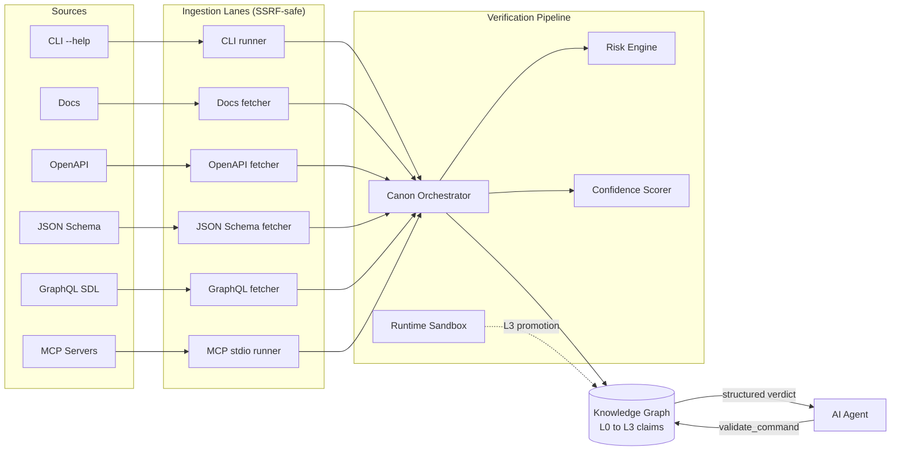

<div align="center">

# AgentAtlas

**A verified, machine-readable knowledge layer for AI agents.**

*Wikipedia tells humans what things are. AgentAtlas tells AI agents what tools can do, how to use them, and whether they're safe.*

[](https://www.python.org/downloads/)
[](#validation)
[](https://docs.astral.sh/ruff/)
[](LICENSE)
[](docs/stage_report.md)

</div>

---

## The Problem

AI agents are about to take real actions on real systems: deleting repositories, deploying to production, sending emails, charging cards. Right now they have **no reliable place to look up what a command actually does, whether it's safe, or whether anyone has verified that knowledge.**

An agent has two options today:

1. Guess from its training data (hallucinations, outdated commands, fabricated flags).
2. Read scraped docs that may contain prompt-injection attacks dressed up as instructions.

Both fail in the same way: when the agent gets it wrong, you find out *after* the production database is gone.

```python
# Without a verified knowledge layer:
agent.run("gh repo delete my-org/production-critical --yes")
# (the LLM "thought" this was safe. it wasn't.)
```

## What AgentAtlas Does

AgentAtlas is a structured, evidence-backed knowledge graph that an agent can query *before* it acts.

```python
verdict = atlas.validate_command(
    tool_id="github-cli",
    command="gh repo delete my-org/production-critical --yes",
)
# {
#   "safe_to_auto_execute": false,
#   "risk_level": "critical",
#   "requires_human_confirmation": true,
#   "reasons": [
#     "Deletes a GitHub repository (irreversible).",
#     "Matches destructive-action pattern: 'delete'."
#   ],
#   "evidence": [
#     "cli_help_output: gh repo delete --help (sha256:5f1c...)",
#     "official_docs: docs.github.com/manual/gh_repo_delete",
#     "destructive_action_classification: deterministic risk engine",
#   ],
#   "verification_level": "L3_runtime_verified",
#   "confidence": 0.92
# }
```

Every fact AgentAtlas serves is backed by **cited, captured evidence** — not LLM reasoning. Every command is **classified for risk** by a deterministic engine, not a chatbot. Every claim is **traceable** to the byte of the source document that grounded it.

## How It Works



Six ingestion lanes pull evidence from trusted sources. A deterministic orchestrator validates schema, classifies risk, scores confidence, deduplicates, and detects conflicts. Accepted claims compile into canonical `ToolSpec` and `WorkflowSpec` records. A runtime sandbox can verify safe checks (e.g., `git --version`) and promote claims to `L3_runtime_verified`. Agents query the result.

## Quick Start

```bash
# 1. Clone and set up
git clone https://github.com/<your-username>/agentatlas.git
cd agentatlas
python3.12 -m venv backend/.venv
backend/.venv/bin/python -m pip install -e 'backend[dev]'

# 2. Seed the demo graph (one command, ~5 seconds, offline-safe)
backend/.venv/bin/python scripts/seed_examples.py --reset

# 3. Start the API
cd backend && .venv/bin/uvicorn app.main:app --reload
```

API is live at `http://localhost:8000` with OpenAPI docs at `/docs`.

A fresh checkout is now populated with **47 claims** spanning 5 tools (`git`,
`github-cli`, `docker`, `vercel-cli`, `openai-api`). The demo's headline
queries work immediately:

```bash
curl -s -X POST http://localhost:8000/query/validate-command \
  -H 'Content-Type: application/json' \
  -d '{"tool_id": "github-cli", "command": "gh repo delete my-org/x --yes"}' \
  | python -m json.tool
```

Returns `safe_to_auto_execute: false`, `risk_level: "critical"`, with cited
evidence from `docs.github.com`.

### Run the dashboard (optional)

Stage 11b ships a minimal Next.js dashboard for visual exploration and the
demo video. Requires Node.js 18+:

```bash
cd frontend
npm install
npm run dev
```

Open <http://localhost:3000>. The dashboard proxies `/api/*` to the FastAPI
backend on `localhost:8000` (configurable via `AGENTATLAS_API_URL`), so the
browser only ever talks to its own origin and no CORS configuration is needed.
Four pages: landing with a try-a-query section, `/tools`, `/tools/[id]`, and
the standalone `/query` playground.

### Other ways to interact

Submit a claim:

```bash
curl -X POST http://localhost:8000/claims \
  -H 'Content-Type: application/json' \
  -d '{
    "claim_type": "destructive_action",
    "subject": "gh repo delete",
    "statement": "Deletes a GitHub repository.",
    "tool_id": "github-cli",
    "submitted_by": "demo-agent",
    "risk_level": "critical",
    "evidence": [{
      "evidence_type": "official_docs",
      "source_uri": "https://docs.github.com/en/github-cli/github-cli/github-cli-reference",
      "excerpt": "gh repo delete deletes a repository.",
      "hash": "sha256:0000000000000000000000000000000000000000000000000000000000000000",
      "captured_at": "2026-05-17T00:00:00+00:00",
      "trust_level": "high"
    }]
  }'
```

Or ingest a whole documentation page automatically:

```bash
curl -X POST http://localhost:8000/ingestion/docs \
  -H 'Content-Type: application/json' \
  -d '{"tool_id": "git", "url": "https://git-scm.com/docs/git-status"}'
```

## Core Principles

These are non-negotiable. They're tested.

| Principle | What it means |
|---|---|
| **Evidence before publication** | No claim enters the canonical graph without cited evidence. LLM reasoning is never primary evidence. |
| **Structured over prose** | Agents submit typed `KnowledgeClaim` objects, not free-form articles. |
| **Safety is first-class** | Every command is classified by side effects, risk, auth requirements, and destructive potential. |
| **Verification levels are explicit** | Claims expose `L0_unverified` through `L5_human_audited`. The orchestrator refuses to inflate. |
| **Provenance is preserved** | Every canonical spec traces back to the source claims and the source bytes. |
| **Treat sources as data, not instructions** | Docs, CLI output, MCP metadata are scanned; any instructions they contain are never executed. |

## What's Built

| Stage | Capability | Status |
|---|---|---|
| 0 — Trust contract | Locked tool scope, evidence types, risk model | ✓ |
| 1 — Persistence | Pydantic + SQLAlchemy + Alembic, drift-locked | ✓ |
| 2 — Claim API | Submit / list / retrieve with evidence policy | ✓ |
| 3 — Orchestrator | Schema validation, dedup, conflict detection | ✓ |
| 4 — Confidence | Weighted scoring, caps, conflict penalties | ✓ |
| 5 — Risk engine | Deterministic, dimension-based, contract-backed | ✓ |
| 6 — Canonical specs | `ToolSpec` / `WorkflowSpec` compilation with provenance | ✓ |
| 7a — CLI ingestion | Safe subprocess capture with argv allowlist | ✓ |
| 7b — Docs ingestion | HTTPS-only fetch with SSRF guard + sanitization | ✓ |
| 7c.1 — OpenAPI | Per-endpoint claims with JSON Pointer provenance | ✓ |
| 7c.2 — JSON Schema | Per-field claims, dialect-aware validation | ✓ |
| 7c.3 — GraphQL SDL | Per-root-field claims with destructive detection | ✓ |
| 7d — MCP metadata | Local stdio spawn + `tools/list` capture | ✓ |
| 8 — Runtime verification | L2 → L3 promotion via safe sandboxed checks | ✓ |
| 9 — Agent query surface | `validate_command`, `search_tools`, `explain_risk`, `safe_workflow`, `get_tool_spec` | ✓ |
| 10 — MCP server wrapper | Expose all 6 query / write tools to Claude Desktop / Cursor over stdio JSON-RPC | ✓ |
| 11a — Seed dataset | `scripts/seed_examples.py` replays pre-captured artifacts; ~47 claims across 5 tools | ✓ |
| 11b — Demo dashboard | Minimal Next.js UI: landing + tools list + tool detail + query playground | ✓ |

See [docs/stage_report.md](docs/stage_report.md) for the full per-stage report including required artifacts, pass-case audit, quality bar, audit log, and what each stage explicitly defers.

## Architecture

```
agentatlas/
├── backend/
│   ├── app/
│   │   ├── api/             # FastAPI routes (claims, canonical, ingestion, verification, query)
│   │   ├── mcp_server/      # Stage 10: stdio JSON-RPC MCP server (6 tools)
│   │   ├── schemas/         # Pydantic v2 typed models
│   │   ├── services/        # Orchestrator, risk engine, ingestion lanes, runtime verifier, query engine
│   │   ├── db/              # SQLAlchemy 2.0 models + session
│   │   └── main.py          # FastAPI app + middleware (body size guard, structured errors)
│   ├── alembic/             # Migrations (drift-locked against models)
│   └── tests/               # 600 tests; ruff clean; hermetic
├── frontend/                # Stage 11b: Next.js demo dashboard (4 pages)
├── data/seed_artifacts/     # Stage 11a: pre-captured artifacts for offline-safe seeding
├── scripts/                 # seed_examples.py and other operator tools
├── contracts/               # Versioned JSON contracts (trust sources, ingestion allowlists, risk taxonomy)
└── docs/                    # Architecture, stage report, claim schema, safety policy
```

### Key design decisions

- **Contracts as ground truth.** Trust allowlists, ingestion sources, and risk taxonomies are versioned JSON files in `contracts/`. They're loaded once, validated, and cached. They cannot drift from the code without a test failing.
- **Protocol-based dependency injection.** Every external dependency (HTTP client, MCP runner, sandbox runner) is a `typing.Protocol`. Tests inject fakes; production injects the real thing. The suite is hermetic — no real network or subprocess execution in CI.
- **Migrations match models.** `tests/test_alembic_metadata_alignment.py` fails on any drift.
- **Structured errors everywhere.** All API errors return `{"error": {"code": "...", "message": "...", "details": {...}}}` with a typed `ErrorCode` enum.
- **Adversarial tests, not happy-path tests.** Every ingestion lane has tests for SSRF, redirect attacks, oversized responses, malformed inputs, content-type bypasses, cache hits with deleted artifacts, and structured 422s.

## API Surface

Core endpoints. Every endpoint returns typed JSON; errors are structured.

**Claims**
- `POST /claims` — submit a structured claim with evidence
- `GET /claims` — paginated list with filters
- `GET /claims/{claim_id}` — retrieve a single claim
- `POST /claims/{claim_id}/verify` — re-run the orchestrator
- `GET /claims/{claim_id}/verification` — get the latest verification result

**Canonical Specs**
- `POST /canonical/tools/{tool_id}/publish` — compile accepted claims into a `ToolSpec`
- `GET /canonical/tools/{tool_id}` — retrieve the published spec
- `POST /canonical/workflows/{workflow_id}/publish`
- `GET /canonical/workflows/{workflow_id}`

**Ingestion**
- `POST /ingestion/cli` / `POST /ingestion/cli/tools/{tool_id}` — Stage 7a
- `POST /ingestion/docs` / `POST /ingestion/docs/tools/{tool_id}` — Stage 7b
- `POST /ingestion/openapi` / `POST /ingestion/openapi/tools/{tool_id}` — Stage 7c.1
- `POST /ingestion/json_schema` / `POST /ingestion/json_schema/tools/{tool_id}` — Stage 7c.2
- `POST /ingestion/graphql` / `POST /ingestion/graphql/tools/{tool_id}` — Stage 7c.3
- `POST /ingestion/mcp` / `POST /ingestion/mcp/publishers/{publisher}` — Stage 7d
- `GET /ingestion/runs/{run_id}` — inspect a run
- `GET /ingestion/artifacts/{artifact_id}` — byte-stable raw evidence

**Runtime Verification**
- `POST /verification/runtime` — promote a claim to L3 by running a safe check
- `POST /verification/runtime/tools/{tool_id}` — bulk-verify all claims for a tool

**Agent Query Surface** (Stage 9 — the agent-facing API)
- `POST /query/validate-command` — *the headline endpoint.* Returns a structured `{safe_to_auto_execute, risk_level, requires_human_confirmation, reasons, evidence, verification_level, confidence}` verdict. Default-deny on no-match.
- `GET /query/tools/{tool_id}` — canonical `ToolSpec` retrieval; 404 if no spec published.
- `GET /query/search-tools?q=&limit=&offset=` — tiered substring search across published tools (tool_id exact > tool_id substring > name substring > capability substring).
- `POST /query/explain-risk` — deterministic risk classification with dimensions (`destructive_action`, `mutates_remote_state`, `reversible`, `requires_auth`, `may_cost_money`, `may_expose_secrets`) plus citing claim ids.
- `POST /query/safe-workflow` — published workflows matching a goal, sorted safest-first.

Live interactive docs at `http://localhost:8000/docs` when the server is running.

## MCP Integration (Stage 10)

AgentAtlas ships with a built-in MCP server that exposes the query surface plus claim submission to any MCP-aware agent client (Claude Desktop, Cursor, Cline, Continue, etc.). One config block in the client and the agent can ask AgentAtlas about safety before acting.

**The MCP tools exposed**

| Tool | What it does |
|---|---|
| `validate_command` | Safety verdict for `{tool_id, command}`. Default-deny on no match. |
| `get_tool_spec` | Full canonical `ToolSpec` for a known tool. |
| `search_tools` | Tiered substring search across published tools. |
| `explain_risk` | Deterministic risk classification + six dimensions + citing claims. |
| `get_safe_workflow` | Goal-matched workflows, safest-first. |
| `submit_claim` | The only write tool — submits a `KnowledgeClaim` with evidence and runs it through the orchestrator. |

**Run the MCP server directly**

```bash
cd backend
.venv/bin/python -m app.mcp_server
```

It speaks JSON-RPC over stdio. Closing stdin (Ctrl-D) exits cleanly.

**Wire it into Claude Desktop**

Edit `~/Library/Application Support/Claude/claude_desktop_config.json` (macOS) — adjust paths for your machine:

```json
{
  "mcpServers": {
    "agentatlas": {
      "command": "/absolute/path/to/AgentAtlas/backend/.venv/bin/python",
      "args": ["-m", "app.mcp_server"],
      "env": {
        "PYTHONPATH": "/absolute/path/to/AgentAtlas/backend",
        "AGENTATLAS_DATABASE_URL": "sqlite:////absolute/path/to/agentatlas.db"
      }
    }
  }
}
```

Restart Claude Desktop. The 6 AgentAtlas tools will appear in the tool list. Ask Claude `"Is it safe to run gh repo delete?"` and the verdict comes back inline with cited evidence.

**Cursor / other MCP clients** — the config shape is the same; consult the client's docs for where to register MCP servers.

**Design notes**

- Server is hand-rolled (no `mcp` SDK dependency). The codebase is sync-throughout; the SDK is async. Stage 7d already implemented the inverse (an MCP *client*) so the protocol is well-understood. If protocol nuances bite later, the tool implementations don't change — only the transport wrapper does.
- Every tool's `inputSchema` declares `additionalProperties: false` so client typos surface as clean rejections instead of silently dropping fields.
- Tool execution failures surface as MCP `isError: True` content blocks (per the MCP spec). Protocol-level failures (parse error, unknown method, unknown tool) surface as JSON-RPC `error` responses. The two paths are kept distinct so clients can write defensive code that treats them differently.
- The server returns both a `content[]` text block (for older clients that string-parse) AND a `structuredContent` object (for newer clients that natively understand structured tool results).

## Validation

```bash
cd backend

# Test suite (600 tests, hermetic, ~30s)
.venv/bin/python -m pytest -q

# Lint
.venv/bin/ruff check app tests

# Migration upgrade / downgrade / upgrade cycle (verifies reversibility)
rm -f /tmp/agentatlas-smoke.db
DATABASE_URL=sqlite:////tmp/agentatlas-smoke.db .venv/bin/alembic upgrade head
DATABASE_URL=sqlite:////tmp/agentatlas-smoke.db .venv/bin/alembic downgrade -5
DATABASE_URL=sqlite:////tmp/agentatlas-smoke.db .venv/bin/alembic upgrade head
```

## Configuration

| Variable | Default | Purpose |
|---|---|---|
| `AGENTATLAS_DATABASE_URL` | `sqlite:///backend/agentatlas.db` | SQLAlchemy URL. SQLite for local dev; Postgres works (use `postgresql+psycopg://...`). |
| `AGENTATLAS_MAX_REQUEST_BYTES` | `1048576` (1 MiB) | Hard cap on request body size; oversized requests get `413 REQUEST_BODY_TOO_LARGE`. |

## What This Isn't (Yet)

Being honest about the gaps:

- **Now exposed as an MCP server (Stage 10 shipped).** AgentAtlas can both *read* MCP servers (Stage 7d) AND *be* an MCP server (Stage 10). See the MCP Integration section above for Claude Desktop / Cursor setup.
- **No dashboard yet.** All interaction is via REST API. Demo UI is planned for Stage 11.
- **No seed dataset.** A fresh install is empty until you ingest. A `scripts/seed_examples.py` is planned.
- **Stage 0 scope is narrow.** Initial tool coverage: `git`, `github-cli`, `docker`, `vercel-cli`, `openai-api` plus 5 MCP servers. Adding tools is a contract change, not code.

The v1.0 plan is in [docs/v1_plan.md](docs/v1_plan.md) (coming next).

## Documentation

- [Stage report](docs/stage_report.md) — per-stage audit with quality bar, pass cases, deferred items, and audit log
- [Claim schema reference](docs/claim_schema.md) — every field of every typed model
- [Verification levels](docs/verification_levels.md) — L0 → L5 with promotion rules
- [Safety policy](docs/safety_policy.md) — risk classification + auto-execute rules
- [Architecture deep-dive](docs/architecture.md) — orchestrator design, evidence trust resolution, contracts

## Contributing

This is an early-stage open source project. Contributions welcome, but please open an issue to discuss before sending a large PR.

Local dev:

```bash
cd backend
python3.12 -m venv .venv
.venv/bin/python -m pip install -e '.[dev]'
.venv/bin/alembic upgrade head
.venv/bin/python -m pytest      # must stay green
.venv/bin/ruff check app tests  # must stay clean
```

Non-negotiables for any PR:

- New domain rules require tests
- Migrations stay reversible (`alembic downgrade -1` must work)
- Contract changes are versioned (`*.v1.json` is locked; new versions get a new file)
- Safety rules never weaken (never expand `allowed_commands`, never widen SSRF guards, never demote evidence-trust requirements)

See [CONTRIBUTING.md](CONTRIBUTING.md) and [SECURITY.md](SECURITY.md) (both coming with Stage 14 polish).

## License

MIT — see [LICENSE](LICENSE).

## Acknowledgements

Built on FastAPI, Pydantic v2, SQLAlchemy 2, Alembic, httpx, `openapi-spec-validator`, `jsonschema`, and `graphql-core`. The MCP protocol implementation follows the [Model Context Protocol](https://modelcontextprotocol.io/) specification.
