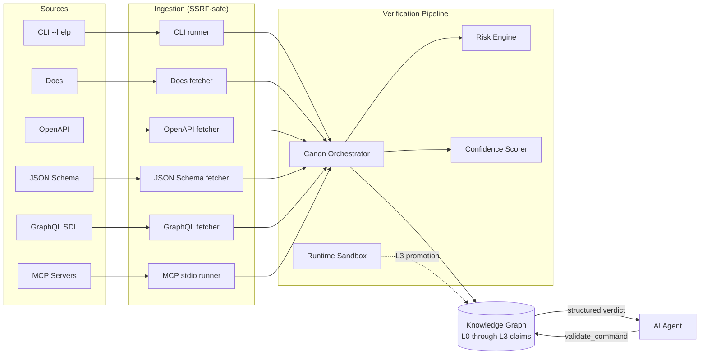

<div align="center">

# Ayiru

**A verified, machine-readable knowledge layer for AI agents.**

Wikipedia tells humans what things are. Ayiru tells AI agents what tools can do, how to use them, and whether they're safe.

[](https://www.python.org/downloads/)
[](#validation)
[](https://docs.astral.sh/ruff/)
[](LICENSE)
[](docs/stage_report.md)

[Quick Start](#quick-start) · [What's Built](#whats-built) · [MCP Integration](#mcp-integration) · [Architecture](#architecture) · [Roadmap](ROADMAP.md)

</div>

---

## The Problem

AI agents are about to take real actions on real systems — deleting repositories, deploying to production, sending emails, charging cards. Right now they have **no reliable place to look up what a command actually does, whether it's safe, or whether anyone has verified that knowledge.**

Today an agent has two options:

1. **Guess from training data** — hallucinated flags, outdated commands, fabricated behaviour.
2. **Read scraped docs** — including any prompt-injection attacks dressed up as instructions.

Both fail the same way: when the agent gets it wrong, you find out *after* the production database is gone.

```python
# Without a verified knowledge layer:
agent.run("gh repo delete my-org/production-critical --yes")
# (the LLM "thought" this was safe. it wasn't.)
```

## What Ayiru Does

A structured, evidence-backed knowledge graph that an agent queries *before* it acts.

```python
verdict = atlas.validate_command(
    tool_id="github-cli",
    command="gh repo delete my-org/production-critical --yes",
)
# {
#   "safe_to_auto_execute": false,
#   "risk_level": "critical",
#   "requires_human_confirmation": true,
#   "verification_level": "L2_source_verified",
#   "confidence": 1.0,
#   "confidence_band": "strong",
#   "matched_claim_id": "claim_…",
#   "match_method": "prefix",
#   "reasons": [
#     "Deleting a GitHub repository is an irreversible remote mutation.",
#     "Safety policy blocks auto-execution at risk level 'critical'."
#   ],
#   "evidence": [
#     {"evidence_type": "official_docs",
#      "source_uri": "https://docs.github.com/en/manual/gh_repo_delete",
#      "trust_level": "high"}
#   ]
# }
```

Every fact Ayiru serves is backed by **cited, captured evidence** — not LLM reasoning. Every command is **classified for risk** by a deterministic engine, not a chatbot. Every claim is **traceable** to the byte of the source document that grounded it.

## How It Works



Six ingestion lanes pull evidence from trusted sources. A deterministic orchestrator validates schema, classifies risk, scores confidence, deduplicates, and detects conflicts. Accepted claims compile into canonical `ToolSpec` and `WorkflowSpec` records. A runtime sandbox verifies safe checks (e.g. `git --version`) and promotes claims to `L3_runtime_verified`. Agents query the result.

## Quick Start

Three install paths land you on a working `ayiru` binary. The repo checkout is the recommended dev path. The standalone wheel install is the production path once PyPI publication ships (scheduled for v0.2; see [plan_v02.md](plan_v02.md) §Stage 16.2). The Docker image is the zero-setup path with auto-seeding on first run.

### From a checkout (recommended for development)

```bash
git clone https://github.com/ruth411/ayiru.git
cd ayiru
python3.12 -m venv backend/.venv
source backend/.venv/bin/activate
pip install -e 'backend[dev]'

ayiru seed --reset       # populate the demo graph (~5s, offline-safe)
ayiru serve --reload     # API on http://localhost:8000
```

OpenAPI docs at <http://localhost:8000/docs>.

After `ayiru seed --reset`, the local graph holds **47 claims** across 5 tools (`git`, `github-cli`, `docker`, `vercel-cli`, `openai-api`) and **4 published ToolSpecs** (`git`, `github-cli`, `docker`, `vercel-cli` — `openai-api`'s OpenAPI-derived claims stay pending review). The headline demo then resolves immediately:

```bash
ayiru query --tool github-cli --command 'gh repo delete my-org/x --yes'
# BLOCK  risk=critical  confidence=1.00
#   matched_claim=claim_…  verification_level=L2_source_verified
#   - Matched claim 'gh repo delete' by prefix.
#   - Safety policy blocks auto-execution at risk level 'critical'.
#   - Deleting a GitHub repository is an irreversible remote mutation.
```

### Standalone wheel install (Stage 14)

The wheel bundles the trust contracts, seed artifacts, and alembic migrations, so an isolated install produces a fully-functional package — no checkout required.

```bash
python3.12 -m venv ~/venv-ayiru
~/venv-ayiru/bin/pip install /path/to/ayiru/backend   # local source build
ayiru seed --reset                                    # uses the bundled demo data
ayiru serve                                           # auto-migrates the schema first
```

> **Note on PyPI.** `pip install ayiru` is not yet a working command — the PyPI publication is part of the v0.2 release plan (see [plan_v02.md](plan_v02.md) §Stage 16.2). For now, install from a local source build as shown above, or from a GitHub release wheel attached to the [v0.1.0 release](https://github.com/ruth411/ayiru/releases/tag/v0.1.0).

### With Docker

```bash
docker build -t ayiru .
docker run --rm -p 8000:8000 ayiru         # serve the API
docker run --rm -i ayiru mcp               # MCP stdio bridge
```

The image bundles the same seed + contracts as the wheel and ships the `ayiru` binary as its entrypoint.

### CLI reference

| Command | Purpose |
|---|---|
| `ayiru serve [--host --port --reload --no-migrate]` | Run the FastAPI app under uvicorn; auto-migrates the schema on first start unless `--no-migrate` is passed |
| `ayiru mcp` | Speak MCP/JSON-RPC over stdio (for Claude Desktop, Cursor, …) |
| `ayiru seed [--reset --database-url URL]` | Replay `data/seed_artifacts/` into the DB |
| `ayiru migrate [--database-url URL]` | `alembic upgrade head` |
| `ayiru query --tool ID --command STR [--json]` | Ask the engine if a command is safe (exits 0 on ALLOW, 2 on BLOCK) |
| `ayiru verify --claim-id ID` | Run the runtime verifier; promote L2 → L3 when it passes |
| `ayiru tools [--json]` | List every published tool spec |
| `ayiru --version` | Print the package version |

### Run the dashboard (optional)

Stage 11b ships a minimal Next.js dashboard for visual exploration and the demo video. Requires Node.js 18+.

```bash
cd frontend
npm install
npm run dev
```

Open <http://localhost:3000>. The dashboard proxies `/api/*` to the FastAPI backend on `localhost:8000` (override with `AYIRU_API_URL`), so the browser only talks to its own origin and no CORS configuration is needed.

## Core Principles

These are non-negotiable. They're tested.

| Principle | What it means |
|---|---|
| **Evidence before publication** | No claim enters the canonical graph without cited evidence. LLM reasoning is never primary evidence. |
| **Structured over prose** | Agents submit typed `KnowledgeClaim` objects, not free-form articles. |
| **Safety is first-class** | Every command is classified by side effects, risk, auth requirements, and destructive potential. |
| **Verification levels are explicit** | Claims expose `L0_unverified` through `L5_human_audited`. The orchestrator refuses to inflate. |
| **Provenance is preserved** | Every canonical spec traces back to the source claims and the source bytes. |
| **Sources are data, not instructions** | Docs, CLI output, MCP metadata are scanned; any instructions they contain are never executed. |

## What's Built

| Stage | Capability | Status |
|---|---|---|
| 0 — Trust contract | Locked tool scope, evidence types, risk model | ✓ |
| 1 — Persistence | Pydantic + SQLAlchemy + Alembic, drift-locked | ✓ |
| 2 — Claim API | Submit / list / retrieve with evidence policy | ✓ |
| 3 — Orchestrator | Schema validation, dedup, conflict detection | ✓ |
| 4 — Confidence | Weighted scoring, caps, conflict penalties | ✓ |
| 5 — Risk engine | Deterministic, dimension-based, contract-backed | ✓ |
| 6 — Canonical specs | `ToolSpec` / `WorkflowSpec` compilation with provenance | ✓ |
| 7a — CLI ingestion | Safe subprocess capture with argv allowlist | ✓ |
| 7b — Docs ingestion | HTTPS-only fetch with SSRF guard + sanitization | ✓ |
| 7c.1 — OpenAPI | Per-endpoint claims with JSON Pointer provenance | ✓ |
| 7c.2 — JSON Schema | Per-field claims, dialect-aware validation | ✓ |
| 7c.3 — GraphQL SDL | Per-root-field claims with destructive detection | ✓ |
| 7d — MCP metadata | Local stdio spawn + `tools/list` capture | ✓ |
| 8 — Runtime verification | L2 → L3 promotion via safe sandboxed checks | ✓ |
| 9 — Agent query surface | `validate_command`, `search_tools`, `explain_risk`, `safe_workflow`, `get_tool_spec` | ✓ |
| 10 — MCP server (outbound) | Expose 6 query / write tools to Claude Desktop / Cursor over stdio JSON-RPC | ✓ |
| 11a — Seed dataset | `scripts/seed_examples.py` replays pre-captured artifacts; ~47 claims across 5 tools | ✓ |
| 11b — Demo dashboard | Minimal Next.js UI: landing + tools list + tool detail + query playground | ✓ |
| 12 — CLI + Docker | One `ayiru` binary on PATH; one-stage Dockerfile | ✓ |
| 13 — Human review + audit | `L5_human_audited` promotion path; append-only audit log; review queue; per-claim history endpoint | ✓ |
| 14 — Hardening | Wheel bundles contracts + seed + migrations; `/v1/` API versioning; observability + request ids; optional API-key auth + reviewer registry; auto-init on serve; Postgres dialect smoke; GitHub Actions CI; LICENSE / CONTRIBUTING / SECURITY | ✓ |

See [docs/stage_report.md](docs/stage_report.md) for the full per-stage report including required artifacts, pass-case audit, quality bar, audit log, and what each stage explicitly defers.

## Architecture

```
Ayiru/
├── backend/
│   ├── app/
│   │   ├── api/             # FastAPI routes (claims, canonical, ingestion, verification, query)
│   │   ├── mcp_server/      # Stage 10 — stdio JSON-RPC MCP server (6 tools)
│   │   ├── schemas/         # Pydantic v2 typed models
│   │   ├── services/        # Orchestrator, risk engine, ingestion lanes, runtime verifier, query engine
│   │   ├── db/              # SQLAlchemy 2.0 models + session
│   │   ├── cli.py           # Stage 12 — the `ayiru` console script
│   │   └── main.py          # FastAPI app + middleware (body size guard, structured errors)
│   ├── alembic/             # Migrations (drift-locked against models)
│   └── tests/               # 699 tests; ruff clean; hermetic
├── frontend/                # Stage 11b — Next.js demo dashboard (4 pages)
├── data/seed_artifacts/     # Stage 11a — pre-captured artifacts for offline-safe seeding
├── scripts/                 # seed_examples.py and other operator tools
├── contracts/               # Versioned JSON contracts (trust sources, ingestion allowlists, risk taxonomy)
├── docs/                    # Stage report, product lock, trust contract, demo scenarios
├── Dockerfile               # Stage 12 — one-stage image
└── ROADMAP.md
```

### Key design decisions

- **Contracts as ground truth.** Trust allowlists, ingestion sources, and risk taxonomies are versioned JSON files in `contracts/`. They're loaded once, validated, and cached. They cannot drift from the code without a test failing.
- **Protocol-based dependency injection.** Every external dependency (HTTP client, MCP runner, sandbox runner) is a `typing.Protocol`. Tests inject fakes; production injects the real thing. The suite is hermetic — no real network or subprocess execution in CI.
- **Migrations match models.** [tests/test_alembic_metadata_alignment.py](backend/tests/test_alembic_metadata_alignment.py) fails on any drift.
- **Structured errors everywhere.** All API errors return `{"error": {"code": "…", "message": "…", "details": {…}}}` with a typed `ErrorCode` enum.
- **Adversarial tests, not happy-path tests.** Every ingestion lane has tests for SSRF, redirect attacks, oversized responses, malformed inputs, content-type bypasses, cache hits with deleted artifacts, and structured 422s.

## API Surface

Every endpoint returns typed JSON; errors are structured.

**Claims**
- `POST /claims` — submit a structured claim with evidence
- `GET /claims` — paginated list with filters
- `GET /claims/{claim_id}` — retrieve a single claim
- `POST /claims/{claim_id}/verify` — re-run the orchestrator
- `GET /claims/{claim_id}/verification` — latest verification result

**Canonical Specs**
- `POST /canonical/tools/{tool_id}/publish` — compile accepted claims into a `ToolSpec`
- `GET /canonical/tools/{tool_id}` — retrieve the published spec
- `POST /canonical/workflows/{workflow_id}/publish`
- `GET /canonical/workflows/{workflow_id}`

**Ingestion**
- `POST /ingestion/cli` · `POST /ingestion/cli/tools/{tool_id}` — Stage 7a
- `POST /ingestion/docs` · `POST /ingestion/docs/tools/{tool_id}` — Stage 7b
- `POST /ingestion/openapi` · `POST /ingestion/openapi/tools/{tool_id}` — Stage 7c.1
- `POST /ingestion/json_schema` · `POST /ingestion/json_schema/tools/{tool_id}` — Stage 7c.2
- `POST /ingestion/graphql` · `POST /ingestion/graphql/tools/{tool_id}` — Stage 7c.3
- `POST /ingestion/mcp` · `POST /ingestion/mcp/publishers/{publisher}` — Stage 7d
- `GET /ingestion/runs/{run_id}` — inspect a run
- `GET /ingestion/artifacts/{artifact_id}` — byte-stable raw evidence

**Runtime Verification**
- `POST /verification/runtime` — promote a claim to L3 via a safe check
- `POST /verification/runtime/tools/{tool_id}` — bulk-verify all claims for a tool

**Human Review** (Stage 13)
- `POST /verification/human-review` — file an `APPROVED` / `REJECTED` / `NEEDS_CHANGES` decision; `APPROVED` against an L3+ claim promotes it to `L5_human_audited`.
- `GET /verification/review-queue` — paginated list of claims awaiting a human decision (`verification_status=requires_human_review`).

**Audit Log** (Stage 13 — append-only)
- `GET /audit/events` — paginated query with filters by `entity_type`, `entity_id`, `event_type`, `actor`, and timestamp range.
- `GET /audit/claims/{claim_id}` — full chronological history of every event recorded against one claim.

**Agent Query Surface** (the agent-facing API)
- `POST /v1/query/ask` — *the v0.2 headline retrieval surface.* Natural-language question in, ranked + cited answers out from the verified knowledge graph. Returns `{answers: [{claim_id, subject, statement, tool_id, confidence, verification_level, evidence, match_reason}], fallback_recommended, estimated_tokens_saved}`. On a miss, `fallback_recommended=True` signals the agent should escalate to web_search.
- `POST /v1/query/validate-command` — Returns a structured `{safe_to_auto_execute, risk_level, requires_human_confirmation, reasons, evidence, verification_level, confidence}` verdict. Default-deny on no match.
- `GET /v1/query/tools/{tool_id}` — canonical `ToolSpec` retrieval; 404 if no spec published.
- `GET /v1/query/search-tools?q=&limit=&offset=` — tiered substring search across published tools.
- `POST /v1/query/explain-risk` — deterministic risk classification with dimensions + citing claim ids.
- `POST /v1/query/safe-workflow` — published workflows matching a goal, sorted safest-first.

Live interactive docs at <http://localhost:8000/docs> when the server is running.

## MCP Integration

Ayiru ships with a built-in MCP server that exposes the query surface plus claim submission to any MCP-aware agent client (Claude Desktop, Cursor, Cline, Continue, …). One config block in the client and the agent can ask Ayiru about safety before acting.

### Tools exposed

| Tool | What it does |
|---|---|
| `ask` | **v0.2 headline.** Natural-language question → ranked, cited answers from the verified knowledge graph. The agent's first stop before `web_search`. Returns `fallback_recommended=True` on a miss. |
| `validate_command` | Safety verdict for `{tool_id, command}`. Default-deny on no match. |
| `get_tool_spec` | Full canonical `ToolSpec` for a known tool. |
| `search_tools` | Tiered substring search across published tools. |
| `explain_risk` | Deterministic risk classification + six dimensions + citing claims. |
| `get_safe_workflow` | Goal-matched workflows, safest-first. |
| `submit_claim` | The only write tool — submits a `KnowledgeClaim` and runs it through the orchestrator. |

### Run it

```bash
ayiru mcp
```

Speaks JSON-RPC over stdio. Closing stdin (Ctrl-D) exits cleanly.

### Wire it into Claude Desktop

Edit `~/Library/Application Support/Claude/claude_desktop_config.json` (macOS):

```json
{
  "mcpServers": {
    "ayiru": {
      "command": "/absolute/path/to/ayiru",
      "args": ["mcp"],
      "env": {
        "AYIRU_DATABASE_URL": "sqlite:////absolute/path/to/ayiru.db"
      }
    }
  }
}
```

Run `which ayiru` inside the activated venv to get the absolute path. Restart Claude Desktop and the 6 Ayiru tools appear in the tool list. Ask Claude `"Is it safe to run gh repo delete?"` and the verdict comes back inline with cited evidence.

**Cursor / other MCP clients** — the config shape is the same; consult the client's docs for where to register MCP servers.

### Design notes

- Server is hand-rolled (no `mcp` SDK dependency). The codebase is sync-throughout; the SDK is async. Stage 7d already implemented the inverse (an MCP *client*) so the protocol is well-understood.
- Every tool's `inputSchema` declares `additionalProperties: false` so client typos surface as clean rejections instead of silently dropping fields.
- Tool execution failures surface as MCP `isError: True` content blocks (per the MCP spec). Protocol-level failures (parse error, unknown method, unknown tool) surface as JSON-RPC `error` responses. The two paths are kept distinct so clients can write defensive code that treats them differently.
- The server returns both a `content[]` text block (for older clients that string-parse) AND a `structuredContent` object (for newer clients that natively understand structured tool results).

## Submitting claims and ingesting docs

Submit a claim directly:

```bash
curl -X POST http://localhost:8000/claims \
  -H 'Content-Type: application/json' \
  -d '{
    "claim_type": "destructive_action",
    "subject": "gh repo delete",
    "statement": "Deletes a GitHub repository.",
    "tool_id": "github-cli",
    "submitted_by": "demo-agent",
    "risk_level": "critical",
    "evidence": [{
      "evidence_type": "official_docs",
      "source_uri": "https://docs.github.com/en/github-cli/github-cli/github-cli-reference",
      "excerpt": "gh repo delete deletes a repository.",
      "hash": "sha256:0000000000000000000000000000000000000000000000000000000000000000",
      "captured_at": "2026-05-18T00:00:00+00:00",
      "trust_level": "high"
    }]
  }'
```

Or ingest a whole documentation page automatically:

```bash
curl -X POST http://localhost:8000/ingestion/docs \
  -H 'Content-Type: application/json' \
  -d '{"tool_id": "git", "url": "https://git-scm.com/docs/git-status"}'
```

## Validation

```bash
cd backend

# Test suite (699 tests, hermetic, ~25s)
.venv/bin/python -m pytest -q

# Lint
.venv/bin/ruff check app tests

# Migration upgrade / downgrade / upgrade cycle
rm -f /tmp/ayiru-smoke.db
DATABASE_URL=sqlite:////tmp/ayiru-smoke.db .venv/bin/alembic upgrade head
DATABASE_URL=sqlite:////tmp/ayiru-smoke.db .venv/bin/alembic downgrade -5
DATABASE_URL=sqlite:////tmp/ayiru-smoke.db .venv/bin/alembic upgrade head
```

## Security model

Auth in v0.1 is intentionally narrow. Two surfaces, two postures:

- **HTTP API.** When `AYIRU_API_KEY` is set, every state-changing request (`POST` / `PUT` / `PATCH` / `DELETE`) must carry `Authorization: Bearer <key>`. Read endpoints stay public so agents can query freely without coordinating credentials with their orchestrator. The check is timing-safe (`hmac.compare_digest`).
- **MCP stdio (`ayiru mcp`).** The stdio JSON-RPC server is **unauthenticated by design**. It assumes the caller is a local process the user already has exec rights to (Claude Desktop, Cursor, Cline, Continue — the typical MCP host configurations spawn the server as their own subprocess). The `AYIRU_API_KEY` middleware does not apply here because there is no transport layer to attach credentials to.

For any network-exposed deployment, run the HTTP API with `AYIRU_API_KEY` set. Reserve `ayiru mcp` for local trusted callers. Piping the stdio server across SSH or a reverse shell exposes write tools (`submit_claim`) without authentication.

See [SECURITY.md](SECURITY.md) for the full threat model and known residual risks (including the MCP stdio asymmetry and the DNS-rebinding window in the SSRF guard).

## Configuration

| Variable | Default | Purpose |
|---|---|---|
| `AYIRU_DATABASE_URL` | `sqlite:///./ayiru.db` | SQLAlchemy URL. SQLite is the test-matrix dialect; Stage 14 verified the schema also compiles cleanly under the Postgres dialect (no live Postgres in CI yet). |
| `AYIRU_ALEMBIC_INI` | autodetected | Optional override path to `alembic.ini`. The CLI resolver tries env-var → source-tree `backend/alembic.ini` → bundled `app/_alembic/` (wheel install) in order. |
| `AYIRU_SEED_SCRIPT` | autodetected | Optional override path to a `seed_examples.py` fork. Without it, `ayiru seed` uses the in-package `app.seed_data.runner`. |
| `AYIRU_API_KEY` | unset (auth off) | When set, Stage 14 enables Bearer-token auth on every state-changing endpoint. Read endpoints stay public regardless. Health endpoints stay public. |
| `AYIRU_REVIEWER_REGISTRY` | unset (open) | Comma-separated allowlist of `reviewer_id` values for `POST /verification/human-review`. When set, unlisted reviewers receive a structured 403. |
| `AYIRU_API_URL` (frontend) | `http://localhost:8000` | Where the dashboard's `/api/*` rewrite points. |

## What This Isn't (Yet)

Being honest about the gaps that remain after Stage 15:

- **Stage 0 scope is narrow.** Initial tool coverage: `git`, `github-cli`, `docker`, `vercel-cli`, `openai-api` plus 5 MCP servers. Adding tools is a contract change, not code. The v0.2 plan ([plan_v02.md](plan_v02.md) §Stage 19/20) relaxes this with a curated/uncurated split and bulk-ingests ≥ 35 more tools.
- **No PyPI upload yet.** The wheel works (Stage 14 bundled everything), but `pip install ayiru` still points at a local build. The PyPI publication ships with v0.2 ([plan_v02.md](plan_v02.md) §Stage 16.2).
- **SQLite is the only tested backend.** SQLAlchemy targets Postgres + the schema is dialect-portable (Stage 14 added an offline DDL smoke), but no `testcontainers`-style live Postgres tests run in CI. v1.1 adds them.
- **No external auth provider integration.** Stage 14 ships an optional API-key gate via env var — solid for protecting a deployment behind a reverse proxy, not a substitute for SSO. OAuth / OIDC integration is v1.1.
- **No rate limiting.** Deploy behind a reverse proxy (nginx, Caddy) that enforces rate limits. Native rate-limiting is v1.1.
- **Reviewer auth is identity-by-string.** `AYIRU_REVIEWER_REGISTRY` is a name allowlist; per-reviewer cryptographic identity (Ed25519 keys, signed reviews) is v1.1.

## Documentation

- [Stage report](docs/stage_report.md) — per-stage audit with quality bar, pass cases, deferred items, and audit log
- [Roadmap](ROADMAP.md) — what each stage exists to prove
- [Product lock](docs/product_lock.md) — what Ayiru is, what it isn't, and the principles that hold for v1
- [Trust contract](docs/trust_contract.md) — claim taxonomy, evidence taxonomy, verification rules, risk semantics
- [Demo scenarios](docs/demo_scenarios.md) — the headline queries the project promises to answer correctly
- [Contributing](CONTRIBUTING.md) — local setup, PR checklist, code style
- [Security policy](SECURITY.md) — vulnerability reporting, what we treat as a vuln, disclosure timeline

## Contributing

This is an early-stage open-source project. Contributions welcome — please open an issue to discuss before sending a large PR.

Local dev:

```bash
cd backend
python3.12 -m venv .venv
.venv/bin/python -m pip install -e '.[dev]'
.venv/bin/alembic upgrade head
.venv/bin/python -m pytest      # must stay green
.venv/bin/ruff check app tests  # must stay clean
```

Non-negotiables for any PR:

- New domain rules require tests.
- Migrations stay reversible (`alembic downgrade -1` must work).
- Contract changes are versioned (`*.v1.json` is locked; new versions get a new file).
- Safety rules never weaken — never expand `allowed_commands`, never widen SSRF guards, never demote evidence-trust requirements.

See [CONTRIBUTING.md](CONTRIBUTING.md) for the full PR checklist and [SECURITY.md](SECURITY.md) for the vulnerability-reporting path.

## License

MIT — see [LICENSE](LICENSE).

## Acknowledgements

Built on FastAPI, Pydantic v2, SQLAlchemy 2, Alembic, httpx, `openapi-spec-validator`, `jsonschema`, and `graphql-core`. The MCP protocol implementation follows the [Model Context Protocol](https://modelcontextprotocol.io/) specification.
