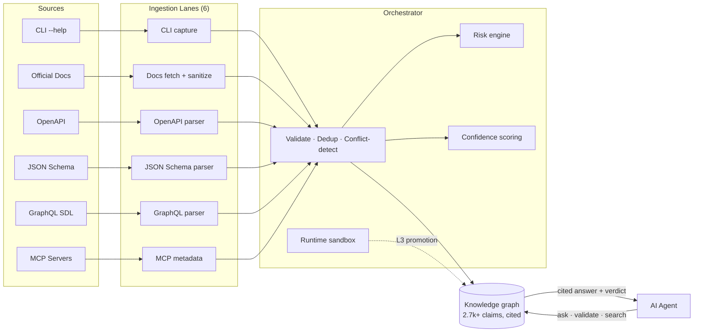

<div align="center">

<br/>

# 🛡️ Ayiru

### **The verified knowledge graph for AI agent tooling.**

*Wikipedia tells humans what things are. Ayiru tells AI agents what tools can do, how to use them, and whether they're safe — with citations.*

<br/>

[](https://www.python.org/downloads/)
[](#-validation)
[](https://docs.astral.sh/ruff/)
[](LICENSE)

[](#-tool-catalog)
[](#-tool-catalog)
[](#-tool-catalog)
[](#-mcp-integration)

<br/>

**[Quick Start](#-quick-start)** · **[Tool Catalog](#-tool-catalog)** · **[Agent Integration](#-how-agents-use-it)** · **[MCP](#-mcp-integration)** · **[Architecture](#-architecture)** · **[SDK](#-python-sdk)**

</div>

---

## 🎯 The Problem

AI agents are about to take real actions on real systems — **deleting repositories, deploying to production, sending emails, charging cards**. Right now they have **no reliable place to look up what a command actually does, whether it's safe, or whether anyone has verified that knowledge.**

<table>
<tr>
<td width="50%">

#### 😱 Without Ayiru

```python
# The LLM "thought" this was safe. It wasn't.
agent.run(
    "gh repo delete my-org/production-critical --yes"
)

# (production database is now gone.)
```

The agent had two options, both bad:

- 🎲 **Guess from training data** — hallucinated flags, outdated commands, fabricated behaviour.
- 🐍 **Scrape docs at runtime** — including any prompt-injection attacks dressed up as instructions.

</td>
<td width="50%">

#### ✅ With Ayiru

```python
from ayiru_client import Ayiru

with Ayiru() as a:
    verdict = a.validate_command(
        "github-cli",
        "gh repo delete my-org/prod --yes",
    )
    if not verdict.safe_to_auto_execute:
        ask_human(verdict.reasons)  # blocked
```

Every fact is:

- 📎 **Backed by cited evidence** — not LLM reasoning
- ⚠️ **Risk-classified** by a deterministic engine
- 🔍 **Fully traceable** to the source bytes that grounded it

</td>
</tr>
</table>

---

## ✨ What You Get

<table>
<tr>
<td width="33%" align="center">

### 📚 Massive catalog

**2,700+ claims**<br/>across **30+ tools**

Every fact crawled from official docs or hand-written with cited evidence. No LLM-generated facts.

</td>
<td width="33%" align="center">

### ⚡ Sub-second answers

`POST /v1/query/ask`

Natural-language question → ranked answer with confidence + verification level + URI citation. Hybrid lexical + semantic re-rank.

</td>
<td width="33%" align="center">

### 🛡️ Safety verdicts

`validate_command()`

Default-deny on unknown commands. Six-dimension risk classification. Auto-execution blocked at `critical` risk.

</td>
</tr>
<tr>
<td width="33%" align="center">

### 🔌 MCP-native

7 tools exposed over JSON-RPC stdio for Claude Desktop, Cursor, Cline, Continue — no SDK dependency.

</td>
<td width="33%" align="center">

### 🐍 Python SDK

`ayiru-client` with sync + async + a drop-in LangChain `BaseTool`. Typed Pydantic responses everywhere.

</td>
<td width="33%" align="center">

### 🔐 Provenance preserved

Every canonical spec traces back to the source claims and the source bytes. Audit log is append-only.

</td>
</tr>
</table>

---

## 📦 Tool Catalog

Ayiru currently indexes **2,700+ claims across 30+ tools** with full per-command depth, plus a wider thin-coverage tail. Each "deep" tool is decomposed into **five surfaces** so an agent's query can target the right slice:

| Surface | What's on it |
|---|---|
| 🟦 **`{tool}-cli`** | Per-command pages from official docs (e.g. `docker run`, `git rebase`) |
| 🟪 **`{tool}-config`** | Config-file format, environment, runtime options |
| 🟩 **`{tool}-recipes`** | Real-world workflows: "trim a video without re-encoding", "force-push safely" |
| 🟥 **`{tool}-errors`** | The actual error messages users hit, with diagnosis + fix steps |
| 🟨 **`{tool}-{topic}`** | Tool-specific extras: `docker-build`, `git-workflows`, `kubectl-resources`, `openssl-ciphers`, `go-stdlib`, `ansible-modules`, … |

<br/>

### 🏆 Deep-coverage tools

Each tool below has been crawled from official docs, supplemented with hand-written error/recipe claims, and probed end-to-end. The **Probe** column is the fraction of representative agent-style questions that returned an actionable answer (confidence ≥ 0.6, evidence-graded). **Perfect-score probes** are starred.

| Tool family | Claims | Probe | Highlights |
|---|---:|---:|---|
| `ansible` (5 surfaces) | **634** | 25/25 ✨ | Modules (499), playbook, inventory, vault, errors |
| `docker` | 136 | 44/45 | CLI + Dockerfile + buildx + compose + errors |
| `gh` (GitHub CLI) | 129 | 49/50 | auth, repo/pr/issue/release, workflows, codespaces |
| `helm` | 128 | 48/50 | Chart authoring + template guide + OCI registry |
| `kubectl` | 127 | **50/50** ⭐ | 43 per-command + 14 resources + RBAC + debugging |
| `openai-api` | 125 | **50/50** ⭐ | Chat / responses / embeddings / vision / whisper / TTS / batch |
| `awk` | 118 | 40/40 ✨ | Language + builtins + regex + scripting patterns |
| `git` | 109 | 46/50 | 31 per-command + workflows + hooks + submodules |
| `go` | 108 | **50/50** ⭐ | 30 stdlib pages + modules + generics + reasoning models |
| `pip` | 105 | 49/50 | PEP 668, hash-pinning, pip-tools, uv migration |
| `cargo` | 105 | 40/40 ✨ | Build profiles, workspaces, features, registries |
| `openssl` | 100 | **50/50** ⭐ | Keys, certs, CSR, PKCS#12, TLS debugging, FIPS |
| `apt` | 164 | 49/49 ✨ | CLI + sources.list + dpkg interop + 99 gap-closers |
| `ffmpeg` | 92 | 38/45 | Filters + codecs + recipes (trim, hwaccel, GIF, HLS) |
| `imagemagick` | 86 | 43/45 | Resize, crop, batch, watermarks, formats, PDF→PNG |
| `gpg` | 82 | 42/45 | Key gen, sign / verify, encrypt, smartcard, gpg-agent |
| `journalctl` | 75 | 44/45 | Filters, fields, persistent storage, rate-limit |
| `jq` | 74 | **45/45** ⭐ | Filters, functions, control flow, real-world pipes |
| `curl` | 73 | 40/40 ✨ | Protocols, auth, file transfer, debugging |
| `brew` | 71 | 33/33 ✨ | Formulae, taps, cleanup, troubleshooting |
| `dnf` | 57 | 37/37 ✨ | Repos, history, modules, troubleshooting |

> ⭐ = perfect probe (50/50). ✨ = perfect probe at smaller probe size.

Plus thin-coverage tool_ids carried from earlier seeding: `terraform`, `vercel`, `postgresql`/`psql-postgres`, `ssh`, `systemctl`, `rsync`, `wget`, `sed`, `vim`, `tmux`, `sqlite3`, `pnpm`, `poetry`, `yarn`, `uv`, `rust`, `supabase`. These return *something* on `ask()` but at lower confidence — they're the next depth-pass targets.

<br/>

### 🔍 Querying the catalog

```bash
# CLI — for humans
ayiru query --tool github-cli --command 'gh repo delete my-org/x --yes'
# 🚫 BLOCK  risk=critical  confidence=1.00
#   ↳ Deleting a GitHub repository is an irreversible remote mutation.

# HTTP — for agents
curl -X POST http://localhost:8000/v1/query/ask \
  -H 'Content-Type: application/json' \
  -d '{"question": "trim a clip without re-encoding", "tool_id_hint": "ffmpeg-recipes"}'
```

The `/v1/query/ask` endpoint returns ranked answers with confidence, verification level, and evidence URIs — agents that call it from their `BaseTool` (LangChain, Cursor, Claude Desktop via MCP) skip the round-trip cost of `web_search` for stable technical questions.

---

## 🤖 How Agents Use It

Three integration paths, one underlying graph:

<table>
<tr>
<td width="33%">

#### 🔌 MCP server

For **Claude Desktop, Cursor, Cline, Continue**.

```json
{
  "mcpServers": {
    "ayiru": {
      "command": "/path/to/ayiru",
      "args": ["mcp"]
    }
  }
}
```

[Full setup ↓](#-mcp-integration)

</td>
<td width="33%">

#### 🌐 HTTP API

For **any framework, any language**.

```python
import httpx
r = httpx.post(
  "http://localhost:8000/v1/query/ask",
  json={"question": "..."},
)
```

[OpenAPI docs](#-api-surface)

</td>
<td width="33%">

#### 🐍 Python SDK

Typed client + **LangChain adapter**.

```python
from ayiru_client import Ayiru
ans = Ayiru().ask("...")
if ans.is_useful:
    ...
```

[SDK reference ↓](#-python-sdk)

</td>
</tr>
</table>

The `Answer.is_useful` heuristic (`confidence ≥ 0.6 AND verification_level != "L0_unverified"`) is the boundary agent code should respect: a USEFUL answer can be returned verbatim; anything else should escalate to `web_search`.

---

## 🛠️ How It Works



Six ingestion lanes pull evidence from trusted sources. A deterministic orchestrator validates schema, classifies risk, scores confidence, deduplicates, and detects conflicts. Accepted claims compile into canonical `ToolSpec` and `WorkflowSpec` records. A runtime sandbox verifies safe checks and promotes claims to `L3_runtime_verified`. Agents query the result.

---

## 🚀 Quick Start

```bash
git clone https://github.com/ruth411/ayiru.git
cd ayiru
python3.12 -m venv backend/.venv
source backend/.venv/bin/activate
pip install -e 'backend[dev]'
```

Two ways to run:

```bash
# (A) Demo graph — small + offline-safe (~47 claims across 5 tools)
ayiru seed --reset
ayiru serve --reload         # http://localhost:8000

# (B) Full catalog — 2.7k claims, 30+ tools with depth
AYIRU_DATABASE_URL="sqlite:///$(pwd)/backend/ayiru_v0.2_bulk.db" ayiru serve --reload
```

Then ask it something:

```bash
curl -X POST http://localhost:8000/v1/query/ask \
  -H 'Content-Type: application/json' \
  -d '{"question": "force-push safely after rebase"}'
```

```json
{
  "answers": [{
    "statement": "`git push --force-with-lease` — succeeds only if remote hasn't moved since your last fetch. Protects against overwriting commits you don't have...",
    "tool_id": "git-recipes",
    "confidence": 0.94,
    "verification_level": "L2_source_verified",
    "evidence": [{"source_uri": "https://git-scm.com/docs/git-push"}]
  }],
  "fallback_recommended": false
}
```

### 🐳 With Docker

```bash
docker build -t ayiru .
docker run --rm -p 8000:8000 ayiru         # serve the API
docker run --rm -i ayiru mcp               # MCP stdio bridge
```

The image bundles the demo seed + contracts. To use the bulk catalog inside Docker, mount the DB file and point `AYIRU_DATABASE_URL` at it.

<details>
<summary><b>📋 CLI reference</b> — every <code>ayiru ...</code> command</summary>

| Command | Purpose |
|---|---|
| `ayiru serve [--host --port --reload --no-migrate]` | Run the FastAPI app under uvicorn; auto-migrates the schema on first start |
| `ayiru mcp` | Speak MCP/JSON-RPC over stdio (for Claude Desktop, Cursor, …) |
| `ayiru seed [--reset --database-url URL]` | Replay `data/seed_artifacts/` into the DB (demo graph) |
| `ayiru ingest --tool-list <file.json> [--source docs --resume]` | Bulk-crawl official docs into the graph (this is how the catalog grows) |
| `ayiru migrate [--database-url URL]` | `alembic upgrade head` |
| `ayiru query --tool ID --command STR [--json]` | Ask the engine if a command is safe (exits 0 on ALLOW, 2 on BLOCK) |
| `ayiru verify --claim-id ID` | Run the runtime verifier; promote L2 → L3 when it passes |
| `ayiru tools [--json]` | List every published tool spec |
| `ayiru --version` | Print the package version |

</details>

---

## 🎯 Core Principles

These are non-negotiable. They're tested.

| Principle | What it means |
|---|---|
| 📎 **Evidence before publication** | No claim enters the canonical graph without cited evidence. LLM reasoning is never primary evidence. |
| 📐 **Structured over prose** | Agents submit typed `KnowledgeClaim` objects, not free-form articles. |
| ⚠️ **Safety is first-class** | Every command is classified by side effects, risk, auth requirements, and destructive potential. |
| 🎚️ **Verification levels are explicit** | Claims expose `L0_unverified` through `L5_human_audited`. The orchestrator refuses to inflate. |
| 🔗 **Provenance is preserved** | Every canonical spec traces back to the source claims and the source bytes. |
| 🛡️ **Sources are data, not instructions** | Docs, CLI output, MCP metadata are scanned; any instructions they contain are never executed. |

---

## 🏗️ Architecture

```
ayiru/
├── backend/
│   ├── app/
│   │   ├── api/             # FastAPI routes (claims, canonical, ingestion, verification, query)
│   │   ├── mcp_server/      # stdio JSON-RPC MCP server (7 tools)
│   │   ├── schemas/         # Pydantic v2 typed models
│   │   ├── services/        # Orchestrator, risk engine, ingestion lanes, runtime verifier, query engine
│   │   ├── db/              # SQLAlchemy 2.0 models + session
│   │   ├── cli.py           # The `ayiru` console script
│   │   └── main.py          # FastAPI app + middleware
│   ├── alembic/             # Migrations (drift-locked against models)
│   ├── ayiru_v0.2_bulk.db   # The full catalog DB (2.7k claims, 30+ tools)
│   └── tests/               # 790 tests; ruff clean; hermetic
├── clients/python/          # ayiru-client SDK (sync + async) + LangChain adapter
├── data/seed_artifacts/     # Pre-captured artifacts for offline-safe demo seeding
├── tools/                   # Bulk-ingest URL lists + synthesized claim seed scripts (per tool)
├── contracts/               # Versioned JSON contracts (trust sources, ingestion allowlists, risk taxonomy)
├── scripts/                 # seed_examples.py and other operator tools
├── docs/                    # Stage report, trust contract, self-test results
└── Dockerfile
```

<details>
<summary><b>🔑 Key design decisions</b></summary>

- **Contracts as ground truth.** Trust allowlists, ingestion sources, and risk taxonomies are versioned JSON files in `contracts/`. They're loaded once, validated, and cached. They cannot drift from the code without a test failing. The same files are mirrored into `backend/app/contracts/` (bundled into wheels) — a `diff` check in CI keeps them byte-identical.
- **Five-surface tool decomposition.** Each major tool is split into `-cli`, `-config`, `-recipes`, `-errors`, and one topic-specific surface (e.g. `-modules`, `-stdlib`). This lets agents direct their queries (`tool_id_hint="docker-errors"`) and lets the matcher rank within the right neighborhood.
- **Protocol-based dependency injection.** Every external dependency (HTTP client, MCP runner, sandbox runner) is a `typing.Protocol`. Tests inject fakes; production injects the real thing. The suite is hermetic — no real network or subprocess execution in CI.
- **Migrations match models.** `tests/test_alembic_metadata_alignment.py` fails on any drift.
- **Structured errors everywhere.** All API errors return `{"error": {"code": "…", "message": "…", "details": {…}}}` with a typed `ErrorCode` enum.
- **Adversarial tests, not happy-path tests.** Every ingestion lane has tests for SSRF, redirect attacks, oversized responses, malformed inputs, content-type bypasses, cache hits with deleted artifacts, and structured 422s.
- **Semantic re-rank via fastembed.** Hybrid lexical + cosine using `BAAI/bge-small-en-v1.5` (~130 MB ONNX, no torch). Embeddings are stored per-claim and re-ranked on top of the lexical first pass.

</details>

---

## 🌐 API Surface

Every endpoint returns typed JSON; errors are structured.

### Agent Query Surface

The agent-facing API, under `/v1/query/` — this is what you wire your agent into.

| Endpoint | Purpose |
|---|---|
| `POST /v1/query/ask` | 🔥 **Headline.** Natural-language question in, ranked + cited answers out. Returns `{answers, fallback_recommended, estimated_tokens_saved}`. |
| `POST /v1/query/validate-command` | 🛡️ Safety verdict: `{safe_to_auto_execute, risk_level, requires_human_confirmation, reasons, evidence, verification_level, confidence}`. Default-deny on no match. |
| `GET /v1/query/tools/{tool_id}` | Canonical `ToolSpec` retrieval; 404 if no spec published. |
| `GET /v1/query/search-tools?q=&limit=&offset=` | Tiered substring search across published tools. |
| `POST /v1/query/explain-risk` | Deterministic risk classification with dimensions + citing claim ids. |
| `POST /v1/query/safe-workflow` | Published workflows matching a goal, sorted safest-first. |

<details>
<summary><b>📥 Claims, Ingestion, Verification, Audit</b> — operator + pipeline endpoints</summary>

**Claims**
- `POST /claims` · `GET /claims` · `GET /claims/{id}` · `POST /claims/{id}/verify` · `GET /claims/{id}/verification`

**Ingestion** — one route per ingestion lane (plus `/tools/{tool_id}` and `/publishers/{publisher}` variants where applicable)
- `POST /ingestion/{cli,docs,openapi,json_schema,graphql,mcp}`
- `GET /ingestion/runs/{run_id}` · `GET /ingestion/artifacts/{artifact_id}` (byte-stable raw evidence)

**Canonical Specs**
- `POST /canonical/tools/{tool_id}/publish` · `GET /canonical/tools/{tool_id}`
- `POST /canonical/workflows/{workflow_id}/publish` · `GET /canonical/workflows/{workflow_id}`

**Runtime Verification & Human Review**
- `POST /verification/runtime` — promote a claim to L3 via a safe check
- `POST /verification/human-review` — file an `APPROVED` / `REJECTED` / `NEEDS_CHANGES` decision; `APPROVED` against an L3+ claim promotes it to `L5_human_audited`
- `GET /verification/review-queue` — paginated list of claims awaiting a human decision

**Audit Log** (append-only)
- `GET /audit/events` — paginated query with filters by `entity_type`, `entity_id`, `event_type`, `actor`, timestamp range
- `GET /audit/claims/{claim_id}` — full chronological history of every event recorded against one claim

</details>

Live interactive docs at <http://localhost:8000/docs> when the server is running.

---

## 🐍 Python SDK

Agents that prefer a typed Python client over raw HTTP can install `ayiru-client` from [clients/python/](clients/python/). Both blocking and async flavors expose the same five methods — `ask`, `validate_command`, `get_tool_spec`, `search_tools`, `savings` — and return Pydantic models.

```python
from ayiru_client import Ayiru

with Ayiru(base_url="http://localhost:8000") as client:
    answer = client.ask("how do I remove a docker volume")
    if answer.is_useful:
        print(answer.top.statement)
    else:
        # Miss — agent code should fall through to web_search here.
        ...
```

`Answer.is_useful` is the convenience heuristic: `confidence ≥ 0.6 AND verification_level != "L0_unverified"`. See [clients/python/README.md](clients/python/README.md) for the full method reference, the async variant, error handling, and auth.

### 🔗 LangChain adapter

A drop-in `BaseTool` for LangChain agents lives at [clients/python/ayiru_client/langchain.py](clients/python/ayiru_client/langchain.py). The tool's LLM-facing `description` is the load-bearing piece — it overrides the default "only use tools when uncertain" meta-policy so the agent actually picks `ask` over `web_search` for stable technical questions.

```bash
pip install -e 'clients/python[langchain]'
```

A runnable demo notebook at [clients/python/examples/langchain_demo.ipynb](clients/python/examples/langchain_demo.ipynb).

---

## 🔌 MCP Integration

Ayiru ships with a built-in MCP server that exposes the query surface plus claim submission to any MCP-aware agent client. One config block in the client and the agent can ask Ayiru about safety before acting.

### Tools exposed

| Tool | What it does |
|---|---|
| 🔥 `ask` | **Headline.** NL question → ranked, cited answers. The agent's first stop before `web_search`. |
| 🛡️ `validate_command` | Safety verdict for `{tool_id, command}`. Default-deny on no match. |
| 📋 `get_tool_spec` | Full canonical `ToolSpec` for a known tool. |
| 🔍 `search_tools` | Tiered substring search across published tools. |
| ⚠️ `explain_risk` | Deterministic risk classification + six dimensions + citing claims. |
| 🗺️ `get_safe_workflow` | Goal-matched workflows, safest-first. |
| ✏️ `submit_claim` | The only write tool — submits a `KnowledgeClaim` and runs it through the orchestrator. |

### Wire it into Claude Desktop

Edit `~/Library/Application Support/Claude/claude_desktop_config.json` (macOS):

```json
{
  "mcpServers": {
    "ayiru": {
      "command": "/absolute/path/to/ayiru",
      "args": ["mcp"],
      "env": {
        "AYIRU_DATABASE_URL": "sqlite:////absolute/path/to/ayiru_v0.2_bulk.db"
      }
    }
  }
}
```

Run `which ayiru` inside the activated venv to get the absolute path. Restart Claude Desktop and the Ayiru tools appear in the tool list.

> **Cursor / other MCP clients** — the config shape is the same; consult the client's docs for where to register MCP servers.

<details>
<summary><b>🧠 Design notes</b> — server internals + protocol choices</summary>

- Server is hand-rolled (no `mcp` SDK dependency). The codebase is sync-throughout; the SDK is async.
- Every tool's `inputSchema` declares `additionalProperties: false` so client typos surface as clean rejections instead of silently dropping fields.
- Tool execution failures surface as MCP `isError: True` content blocks. Protocol-level failures (parse error, unknown method, unknown tool) surface as JSON-RPC `error` responses. The two paths are kept distinct so clients can write defensive code that treats them differently.
- The server returns both a `content[]` text block (for older clients that string-parse) AND a `structuredContent` object (for newer clients that natively understand structured tool results).

</details>

---

## 📈 Growing the Catalog

Adding a new tool follows a five-step pattern that's repeatable in ~30 minutes per tool:

1. 📜 **Add the tool to the trust contract** (`contracts/tool_trust_sources.v1.json`) — declare official hosts.
2. 🔗 **Build a URL list** in `tools/v0.2_seed_<tool>.json` covering CLI commands, config, and any topic-specific pages.
3. 🛂 **Patch `contracts/docs_ingestion_sources.v1.json`** with the URLs + subjects (a small script does both mirrors at once).
4. 🕷️ **Crawl**: `ayiru ingest --tool-list tools/v0.2_seed_<tool>.json --source docs --resume`.
5. ✍️ **Synthesize errors + recipes** via a `tools/scripts/seed_<tool>_errors_recipes.py` (typically 30 errors + 35 recipes per tool, hand-written from real-world experience).

After each tool: probe with ~45 representative questions, check `tests` + `ruff`, commit. See `tools/scripts/seed_*_errors_recipes.py` for the pattern in practice across 21 tools.

---

## 📨 Submitting claims and ingesting docs

Submit a claim directly:

```bash
curl -X POST http://localhost:8000/claims \
  -H 'Content-Type: application/json' \
  -d '{
    "claim_type": "destructive_action",
    "subject": "gh repo delete",
    "statement": "Deletes a GitHub repository.",
    "tool_id": "github-cli",
    "submitted_by": "demo-agent",
    "risk_level": "critical",
    "evidence": [{
      "evidence_type": "official_docs",
      "source_uri": "https://docs.github.com/en/github-cli/github-cli/github-cli-reference",
      "excerpt": "gh repo delete deletes a repository.",
      "hash": "sha256:0000000000000000000000000000000000000000000000000000000000000000",
      "captured_at": "2026-05-18T00:00:00+00:00",
      "trust_level": "high"
    }]
  }'
```

Or ingest a whole documentation page automatically:

```bash
curl -X POST http://localhost:8000/ingestion/docs \
  -H 'Content-Type: application/json' \
  -d '{"tool_id": "git-cli", "url": "https://git-scm.com/docs/git-status"}'
```

---

## ✅ Validation

```bash
cd backend

# Test suite (790 tests, hermetic, ~55s)
.venv/bin/python -m pytest -q

# Lint
.venv/bin/ruff check app tests

# Migration upgrade / downgrade / upgrade cycle
rm -f /tmp/ayiru-smoke.db
DATABASE_URL=sqlite:////tmp/ayiru-smoke.db .venv/bin/alembic upgrade head
DATABASE_URL=sqlite:////tmp/ayiru-smoke.db .venv/bin/alembic downgrade -5
DATABASE_URL=sqlite:////tmp/ayiru-smoke.db .venv/bin/alembic upgrade head
```

---

## 🔐 Security Model

<table>
<tr>
<td width="50%">

#### 🌐 HTTP API

When `AYIRU_API_KEY` is set, every state-changing request (`POST` / `PUT` / `PATCH` / `DELETE`) must carry `Authorization: Bearer <key>`.

Read endpoints stay public so agents can query freely without coordinating credentials. The check is timing-safe (`hmac.compare_digest`).

</td>
<td width="50%">

#### 🔌 MCP stdio

The stdio JSON-RPC server is **unauthenticated by design**. It assumes the caller is a local process the user already has exec rights to (Claude Desktop, Cursor, …).

The `AYIRU_API_KEY` middleware does not apply here — there's no transport layer to attach credentials to.

</td>
</tr>
</table>

> ⚠️ For any network-exposed deployment, run the HTTP API with `AYIRU_API_KEY` set. Reserve `ayiru mcp` for local trusted callers. Piping the stdio server across SSH or a reverse shell exposes write tools (`submit_claim`) without authentication.

See [SECURITY.md](SECURITY.md) for the full threat model and known residual risks.

---

<details>
<summary><b>⚙️ Configuration</b> — environment variables</summary>

| Variable | Default | Purpose |
|---|---|---|
| `AYIRU_DATABASE_URL` | `sqlite:///./ayiru.db` | SQLAlchemy URL. Point it at `backend/ayiru_v0.2_bulk.db` to use the full catalog. SQLite is the test-matrix dialect; the schema also compiles cleanly under Postgres. |
| `AYIRU_ALEMBIC_INI` | autodetected | Optional override path to `alembic.ini`. The CLI resolver tries env-var → source-tree `backend/alembic.ini` → bundled `app/_alembic/` (wheel install) in order. |
| `AYIRU_SEED_SCRIPT` | autodetected | Optional override path to a `seed_examples.py` fork. Without it, `ayiru seed` uses the in-package `app.seed_data.runner`. |
| `AYIRU_API_KEY` | unset (auth off) | When set, enables Bearer-token auth on every state-changing endpoint. Read endpoints stay public regardless. Health endpoints stay public. |
| `AYIRU_REVIEWER_REGISTRY` | unset (open) | Comma-separated allowlist of `reviewer_id` values for `POST /verification/human-review`. When set, unlisted reviewers receive a structured 403. |
| `AYIRU_STRICT_TOOL_LOCK` | unset (relaxed) | When `1`/`true`/`yes`/`on`, restores hard-reject behavior — claims with tool_ids not in the v2 contract's curated set are refused at `POST /claims`. Default (relaxed) lets unknown tools persist at `L0_UNVERIFIED` so bulk ingest can land without contract bumps. |

</details>

<details>
<summary><b>🚧 What This Isn't (Yet)</b> — known gaps</summary>

- **The catalog is broad, not exhaustive.** ~30 tool families have full depth-pass treatment; another ~15 have thin coverage from earlier seeding. New tools land in ~30 minutes each via the pattern in [Growing the Catalog](#-growing-the-catalog) — but real-world coverage of a tool's full surface (every flag, every edge case) is a long tail.
- **Freshness story is manual.** Re-running `ayiru ingest --resume` re-fetches changed pages, but there's no automated detection of upstream changes. v1.1 adds change-feed monitoring.
- **No PyPI upload yet.** Install from a local source build or a GitHub release wheel. `pip install ayiru` and `pip install ayiru-client` are the next release.
- **SQLite is the only tested backend.** SQLAlchemy targets Postgres + the schema is dialect-portable (an offline DDL smoke test runs in CI), but no `testcontainers`-style live Postgres tests run in CI yet.
- **No external auth provider integration.** Bearer-token auth via env var is solid for protecting a deployment behind a reverse proxy, not a substitute for SSO. OAuth / OIDC is v1.1.
- **No rate limiting.** Deploy behind a reverse proxy (nginx, Caddy) that enforces rate limits. Native rate-limiting is v1.1.
- **Reviewer auth is identity-by-string.** `AYIRU_REVIEWER_REGISTRY` is a name allowlist; per-reviewer cryptographic identity (Ed25519 keys, signed reviews) is v1.1.

</details>

---

## 📚 Documentation

- 📖 [Stage report](docs/stage_report.md) — historical per-stage audit with quality bar, pass cases, deferred items
- 🔒 [Trust contract](docs/trust_contract.md) — claim taxonomy, evidence taxonomy, verification rules, risk semantics
- 🧪 [Self-test results](docs/self_test_results.md) — headline-demo scoring history
- 🤝 [Contributing](CONTRIBUTING.md) — local setup, PR checklist, code style
- 🛡️ [Security policy](SECURITY.md) — vulnerability reporting, what counts as a vuln, disclosure timeline
- 🐍 [SDK README](clients/python/README.md) — full method reference, async client, error handling, LangChain adapter

---

## 🤝 Contributing

This is an early-stage open-source project. Contributions welcome — please open an issue to discuss before sending a large PR.

```bash
cd backend
python3.12 -m venv .venv
.venv/bin/python -m pip install -e '.[dev]'
.venv/bin/alembic upgrade head
.venv/bin/python -m pytest      # must stay green
.venv/bin/ruff check app tests  # must stay clean
```

**Non-negotiables for any PR:**

- ✅ New domain rules require tests.
- ✅ Migrations stay reversible (`alembic downgrade -1` must work).
- ✅ Contract changes are versioned (`*.v1.json` is locked; new versions get a new file).
- ✅ Safety rules never weaken — never expand `allowed_commands`, never widen SSRF guards, never demote evidence-trust requirements.
- ✅ Lockstep mirrors stay byte-identical: `diff contracts/*.json backend/app/contracts/*.json` must be empty.

See [CONTRIBUTING.md](CONTRIBUTING.md) for the full PR checklist and [SECURITY.md](SECURITY.md) for the vulnerability-reporting path.

---

## 📜 License

**MIT** — see [LICENSE](LICENSE).

## 🙏 Acknowledgements

Built on [FastAPI](https://fastapi.tiangolo.com/), [Pydantic v2](https://docs.pydantic.dev/), [SQLAlchemy 2](https://www.sqlalchemy.org/), [Alembic](https://alembic.sqlalchemy.org/), [httpx](https://www.python-httpx.org/), `openapi-spec-validator`, `jsonschema`, `graphql-core`, and [`fastembed`](https://github.com/qdrant/fastembed) (ONNX-backed `BAAI/bge-small-en-v1.5` for semantic re-rank). The MCP protocol implementation follows the [Model Context Protocol](https://modelcontextprotocol.io/) specification.

<div align="center">

<br/>

**[⬆ back to top](#-ayiru)**

</div>
