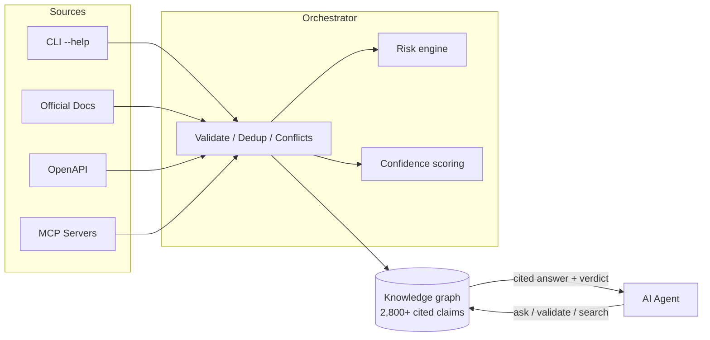

<div align="center">

<br/>

```
   █████╗ ██╗   ██╗██╗██████╗ ██╗   ██╗
  ██╔══██╗╚██╗ ██╔╝██║██╔══██╗██║   ██║
  ███████║ ╚████╔╝ ██║██████╔╝██║   ██║
  ██╔══██║  ╚██╔╝  ██║██╔══██╗██║   ██║
  ██║  ██║   ██║   ██║██║  ██║╚██████╔╝
  ╚═╝  ╚═╝   ╚═╝   ╚═╝╚═╝  ╚═╝ ╚═════╝
```

### **Stop your AI agent from hallucinating CLI commands.**

*A verified, cited knowledge graph that AI agents query before they act.<br/>2,800+ claims across 60+ tools — every fact has a citation, no LLM guessing.*

<br/>

[](https://www.python.org/downloads/)
[](#-verify-it-works)
[](LICENSE)

[](#-tool-catalog)
[](#-tool-catalog)
[](#-tool-catalog)
[](#-claude-cursor-cline-mcp)

---

### 🚀 **Get started in 30 seconds**

```bash
git clone https://github.com/ruth411/ayiru.git && cd ayiru
docker build -t ayiru . && docker run --rm -p 8000:8000 ayiru
```

Then open <http://localhost:8000/docs> in your browser. **That's it. ✨**

</div>

---

## 🤔 What is this?

You're building an AI agent. It needs to run real commands on real systems — `kubectl delete`, `gh repo delete`, `docker rm`, `git push --force`. **What could go wrong?**

<table>
<tr>
<td width="50%">

### 😱 Without Ayiru

```python
# The LLM "thought" this was safe.
# It wasn't.
agent.run(
  "gh repo delete prod --yes"
)
# Production. Gone. 💀
```

Your agent guesses from training data. That training data is **months old**, contains **deprecated flags**, and has **no citations**.

</td>
<td width="50%">

### ✅ With Ayiru

```python
from ayiru_client import Ayiru

with Ayiru() as a:
    v = a.validate_command(
        "github-cli",
        "gh repo delete prod --yes"
    )
    if not v.safe_to_auto_execute:
        ask_human(v.reasons)  # blocked ✋
```

Every fact comes from **official docs**, with **citations** and a **deterministic risk score**.

</td>
</tr>
</table>

---

## 📥 Install Ayiru

> **Pick your path.** Each one ends with a running Ayiru server on `http://localhost:8000`.

<table>
<tr>
<td width="33%" align="center">

### 🐳 Docker
**~3 minutes**<br/>
Zero Python setup<br/>
Full catalog (2,800 claims)<br/>
<br/>
[→ Jump to Docker](#-path-1-docker-easiest)

</td>
<td width="33%" align="center">

### 🐍 Python
**~5 minutes**<br/>
Hackable + local files<br/>
Best for SDK users<br/>
<br/>
[→ Jump to Python](#-path-2-python--pip-for-developers)

</td>
<td width="33%" align="center">

### 🛠 Source
**~10 minutes**<br/>
Edit + test changes<br/>
Best for contributors<br/>
<br/>
[→ Jump to source](#-path-3-from-source-for-contributors)

</td>
</tr>
</table>

---

### 🐳 Path 1: Docker (easiest)

> **Best if:** you just want to try Ayiru. No Python knowledge needed.

#### ✅ Before you start

You need [Docker Desktop](https://www.docker.com/products/docker-desktop/) (macOS / Windows) or `docker` (Linux). Verify:

```bash
docker --version
# Docker version 27.x or newer ✓
```

#### Step 1 — Clone the repo

```bash
git clone https://github.com/ruth411/ayiru.git
cd ayiru
```

#### Step 2 — Build the image

```bash
docker build -t ayiru .
```

> **What's happening?** Docker is building a self-contained image with Python, Ayiru, and the full 2,800-claim catalog. Takes ~2 minutes the first time.

#### Step 3 — Run it

```bash
docker run --rm -p 8000:8000 ayiru
```

You should see:

```
INFO:     Uvicorn running on http://0.0.0.0:8000
INFO:     Started server process [1]
INFO:     Waiting for application startup.
INFO:     Application startup complete.
```

#### Step 4 — Try your first query ✨

In a new terminal:

```bash
curl -X POST http://localhost:8000/v1/query/ask \
  -H 'Content-Type: application/json' \
  -d '{"question": "how do I force-push safely after rebase?"}'
```

Or open the interactive docs at **<http://localhost:8000/docs>** in your browser.

🎉 **Done.** Skip to [Your First Query](#-your-first-query) to see what Ayiru can do.

---

### 🐍 Path 2: Python + pip (for developers)

> **Best if:** you want to write Python code against Ayiru locally.

#### ✅ Before you start

You need **Python 3.12+**. Check:

```bash
python3 --version
# Python 3.12.x ✓
```

<details>
<summary><b>Don't have Python 3.12?</b> Click to install</summary>

- **macOS:** `brew install python@3.12`
- **Linux (Ubuntu):** `sudo apt install python3.12 python3.12-venv`
- **Windows:** [Download from python.org](https://www.python.org/downloads/)

</details>

#### Step 1 — Clone + enter the repo

```bash
git clone https://github.com/ruth411/ayiru.git
cd ayiru
```

#### Step 2 — Create a virtual environment

```bash
python3.12 -m venv backend/.venv
source backend/.venv/bin/activate    # macOS/Linux
# .\backend\.venv\Scripts\activate   # Windows PowerShell
```

> **What's a venv?** A folder that holds Ayiru's dependencies, so it doesn't conflict with anything else on your system.

#### Step 3 — Install Ayiru

```bash
pip install -e 'backend[dev]'
```

> **Why `-e`?** "Editable install" — changes you make to the code show up immediately.

#### Step 4 — Start the server

Two flavors depending on what you want:

```bash
# (a) Demo graph — small, offline-safe (~47 claims, 5 tools)
ayiru seed --reset
ayiru serve --reload

# (b) Full catalog — 2,800 claims, 60+ tools
AYIRU_DATABASE_URL="sqlite:///$(pwd)/backend/ayiru_v0.2_bulk.db" \
    ayiru serve --reload
```

You should see:

```
INFO:     Uvicorn running on http://127.0.0.1:8000
INFO:     Started server process
INFO:     Application startup complete.
```

#### Step 5 — Try it

Open <http://localhost:8000/docs> in your browser or run the curl command from Path 1 above.

🎉 **Done.** Skip to [Your First Query](#-your-first-query).

---

### 🛠 Path 3: From source (for contributors)

> **Best if:** you want to modify Ayiru, run tests, add tools to the catalog.

Same as Path 2, plus:

```bash
# Run the test suite (~55 seconds, 790 tests)
cd backend
.venv/bin/python -m pytest -q

# Lint
.venv/bin/ruff check app tests
```

For adding a new tool to the catalog, see [Growing the Catalog](#-growing-the-catalog).

---

## ✨ Your First Query

Once Ayiru is running on `http://localhost:8000`, try these:

### 1️⃣ Ask a natural-language question

```bash
curl -s -X POST http://localhost:8000/v1/query/ask \
  -H 'Content-Type: application/json' \
  -d '{"question": "trim a video without re-encoding"}' | jq
```

**Expected response:**

```json
{
  "answers": [{
    "statement": "Cut a section of video instantly. `ffmpeg -ss 00:01:30 -to 00:02:00 -i in.mp4 -c copy out.mp4`. `-c copy` skips re-encoding (no quality loss, near-instant)...",
    "tool_id": "ffmpeg-recipes",
    "confidence": 0.95,
    "verification_level": "L2_source_verified",
    "evidence": [{
      "source_uri": "https://ffmpeg.org/ffmpeg.html",
      "trust_level": "high"
    }]
  }],
  "fallback_recommended": false
}
```

### 2️⃣ Check if a command is safe

```bash
curl -s -X POST http://localhost:8000/v1/query/validate-command \
  -H 'Content-Type: application/json' \
  -d '{"tool_id": "github-cli", "command": "gh repo delete prod --yes"}' | jq
```

**Expected response:**

```json
{
  "safe_to_auto_execute": false,
  "risk_level": "critical",
  "requires_human_confirmation": true,
  "verification_level": "L2_source_verified",
  "reasons": [
    "Deleting a GitHub repository is an irreversible remote mutation.",
    "Safety policy blocks auto-execution at risk level 'critical'."
  ]
}
```

### 3️⃣ Use the Python SDK

```python
from ayiru_client import Ayiru

with Ayiru(base_url="http://localhost:8000") as client:
    # Ask anything
    answer = client.ask("how do I copy files between docker containers")
    if answer.is_useful:
        print(answer.top.statement)
        print(f"📎 Source: {answer.top.evidence[0].source_uri}")

    # Or check command safety
    v = client.validate_command("kubectl", "kubectl delete ns production")
    print(f"Safe to auto-execute: {v.safe_to_auto_execute}")
```

---

## 🤖 Use it with Claude, Cursor, Cline (MCP)

Ayiru speaks **Model Context Protocol** out of the box — any MCP-aware client can use it.

### Claude Desktop (macOS)

**Step 1 — Find your `ayiru` binary:**

```bash
which ayiru
# /Users/you/path/to/ayiru/backend/.venv/bin/ayiru
```

**Step 2 — Edit Claude's config:**

```bash
open ~/Library/Application\ Support/Claude/claude_desktop_config.json
```

**Step 3 — Add Ayiru as an MCP server:**

```json
{
  "mcpServers": {
    "ayiru": {
      "command": "/absolute/path/to/ayiru",
      "args": ["mcp"],
      "env": {
        "AYIRU_DATABASE_URL": "sqlite:////absolute/path/to/ayiru/backend/ayiru_v0.2_bulk.db"
      }
    }
  }
}
```

**Step 4 — Restart Claude Desktop.** You'll see 7 new tools in the tool list. Ask Claude:

> *"Is it safe to run `gh repo delete my-org/prod --yes`?"*

Claude will query Ayiru, see it's flagged `critical`, and warn you. 🛡️

<details>
<summary><b>Cursor / Cline / Continue / other MCP clients</b></summary>

Same config shape — consult your client's docs for the JSON location. The seven tools Ayiru exposes:

| Tool | What it does |
|---|---|
| 🔥 `ask` | Natural-language question → ranked, cited answers |
| 🛡️ `validate_command` | Safety verdict for `{tool_id, command}` |
| 📋 `get_tool_spec` | Full canonical spec for a tool |
| 🔍 `search_tools` | Search across published tools |
| ⚠️ `explain_risk` | Risk classification with reasons |
| 🗺️ `get_safe_workflow` | Goal-matched workflows, safest first |
| ✏️ `submit_claim` | Add a new claim to the graph (write tool) |

</details>

---

## 📦 Tool Catalog

Ayiru indexes **2,800+ claims across 60+ tools** with full per-command depth. Each "deep" tool is decomposed into **five surfaces** so an agent's query can target the right slice:

| Surface | What's on it |
|---|---|
| 🟦 **`{tool}-cli`** | Per-command pages from official docs (`docker run`, `git rebase`) |
| 🟪 **`{tool}-config`** | Config-file format, environment, runtime options |
| 🟩 **`{tool}-recipes`** | Real-world workflows: "trim a video", "force-push safely" |
| 🟥 **`{tool}-errors`** | Actual error messages with diagnosis + fix steps |
| 🟨 **`{tool}-{topic}`** | Tool-specific extras: `docker-build`, `git-workflows`, `kubectl-resources`, `go-stdlib`, `ansible-modules` |

### 🏆 Deep-coverage tools

⭐ = perfect probe (50/50 questions returned actionable cited answers)

<details open>
<summary><b>30+ tools with full depth-pass coverage</b></summary>

| Tool | Claims | Probe | Highlights |
|---|---:|---:|---|
| `ansible` | 634 | 25/25 ⭐ | Modules (499), playbook, vault, inventory |
| `docker` | 136 | 44/45 | CLI + Dockerfile + buildx + compose |
| `gh` (GitHub) | 129 | 49/50 | auth, pr, repo, workflows, codespaces |
| `helm` | 128 | 48/50 | Charts + template guide + OCI registry |
| `kubectl` | 127 | 50/50 ⭐ | 43 per-command + RBAC + debugging |
| `openai-api` | 125 | 50/50 ⭐ | Chat / embeddings / vision / whisper |
| `awk` | 118 | 40/40 ⭐ | Language + builtins + scripting |
| `git` | 109 | 46/50 | 31 per-command + hooks + submodules |
| `go` | 108 | 50/50 ⭐ | 30 stdlib + generics + reasoning models |
| `pip` | 105 | 49/50 | PEP 668, hash-pinning, uv migration |
| `cargo` | 105 | 40/40 ⭐ | Build profiles, workspaces, features |
| `openssl` | 100 | 50/50 ⭐ | Keys, certs, CSR, TLS debugging |
| `postgresql` | 101 | 50/50 ⭐ | 23 CLIs + WAL + replication + recovery |
| `postgresql-psql` | 91 | 50/50 ⭐ | Meta-commands + variables + scripting |
| `pnpm` | 107 | 50/50 ⭐ | Workspaces, catalogs, patch deps |
| `poetry` | 99 | 50/50 ⭐ | Groups, lockfile, deploy patterns |
| `sqlite3` | 96 | 50/50 ⭐ | SQL + WAL + JSON1 + FTS5 + pgvector |
| `sed` | 84 | 50/50 ⭐ | Substitution + regex + GNU vs BSD |
| `jq` | 74 | 45/45 ⭐ | Filters + functions + real pipelines |
| `journalctl` | 75 | 44/45 | Filters, fields, persistent storage |
| `apt` | 164 | 49/49 ⭐ | CLI + sources + dpkg interop |
| `rust` | 113 | 48/50 | Lang + stdlib + cargo errors |
| `supabase` | 98 | 49/50 | CLI + migrations + RLS + edge fns |
| `ffmpeg` | 92 | 38/45 | Filters + recipes (trim, hwaccel, GIF) |
| `imagemagick` | 86 | 43/45 | Resize, watermark, PDF→PNG |
| `gpg` | 82 | 42/45 | Key gen, sign/verify, smartcard |
| `rsync` | 70 | 48/50 | Mirror, hardlinks, daemon, SSL |
| `ssh` | 66 | 45/45 ⭐ | Keys, config, tunnels, hardening |
| `curl` | 73 | 40/40 ⭐ | Protocols, auth, debugging |
| `brew` | 71 | 33/33 ⭐ | Formulae, taps, troubleshooting |
| `dnf` | 57 | 37/37 ⭐ | Repos, history, modules |

</details>

Plus thin-coverage entries carried from earlier seeding: `terraform`, `vercel`, `systemctl`, `wget`, `vim`, `tmux`, `uv`, `yarn` — next depth-pass targets.

---

## 🛠️ How It Works



**Six ingestion lanes** pull evidence from trusted sources. A **deterministic orchestrator** validates schema, classifies risk, scores confidence, deduplicates, and detects conflicts. Accepted claims compile into canonical `ToolSpec` records. A **runtime sandbox** verifies safe checks (e.g. `git --version`) and promotes claims. **Agents query the result.**

---

## 🎯 Core Principles

| Principle | What it means |
|---|---|
| 📎 **Evidence before publication** | No claim enters the graph without cited evidence. LLM reasoning is never primary evidence. |
| 📐 **Structured over prose** | Agents submit typed `KnowledgeClaim` objects, not free-form articles. |
| ⚠️ **Safety is first-class** | Every command is classified by side effects, risk, auth, destructive potential. |
| 🎚️ **Verification levels are explicit** | Claims expose `L0_unverified` → `L5_human_audited`. No silent inflation. |
| 🔗 **Provenance is preserved** | Every canonical spec traces back to source claims and source bytes. |
| 🛡️ **Sources are data, not instructions** | Docs, CLI output, MCP metadata are scanned; their instructions are never executed. |

---

## 🚨 Troubleshooting

### "docker: command not found"
→ Install [Docker Desktop](https://www.docker.com/products/docker-desktop/). On Linux, `sudo apt install docker.io`.

### "Port 8000 is already in use"
```bash
docker run --rm -p 8080:8000 ayiru   # use port 8080 instead
```

### "Python 3.12 is too new / not available"
Install with [pyenv](https://github.com/pyenv/pyenv) or [mise](https://mise.jdx.dev/):
```bash
pyenv install 3.12 && pyenv local 3.12
```

### "Ayiru returns `fallback_recommended: true`"
That's by design — Ayiru is being honest that it doesn't have a high-confidence answer. Your agent should escalate to web search.

### "I can't find my Claude Desktop config"
- **macOS:** `~/Library/Application Support/Claude/claude_desktop_config.json`
- **Windows:** `%APPDATA%\Claude\claude_desktop_config.json`
- **Linux:** `~/.config/Claude/claude_desktop_config.json`

### Tests pass locally but Docker build fails
Clear Docker cache: `docker system prune -a` then rebuild.

---

## 🏗️ Architecture

```
ayiru/
├── backend/
│   ├── app/                # FastAPI app, MCP server, services
│   ├── alembic/            # Migrations
│   ├── ayiru_v0.2_bulk.db  # 🌟 Full catalog (2,800 claims)
│   └── tests/              # 790 hermetic tests
├── clients/python/         # ayiru-client SDK + LangChain adapter
├── tools/                  # URL lists + seed scripts (per tool)
├── contracts/              # Versioned JSON trust + ingestion contracts
├── data/seed_artifacts/    # Demo seed for offline-safe install
└── Dockerfile              # Single-stage image
```

<details>
<summary><b>🔑 Key design decisions</b></summary>

- **Contracts as ground truth.** Trust allowlists, ingestion sources, risk taxonomies are versioned JSON files in `contracts/`. They can't drift from code without a test failing.
- **Five-surface tool decomposition.** Each major tool splits into `-cli`, `-config`, `-recipes`, `-errors`, and one topic-specific surface. Lets agents direct queries and lets the matcher rank within the right neighborhood.
- **Protocol-based dependency injection.** Every external dep (HTTP client, MCP runner, sandbox) is a `typing.Protocol`. Tests inject fakes; production injects real things. Hermetic test suite.
- **Adversarial tests, not happy-path tests.** Every ingestion lane has tests for SSRF, redirect attacks, oversized responses, malformed inputs, structured 422s.
- **Semantic re-rank via fastembed.** Hybrid lexical + cosine using `BAAI/bge-small-en-v1.5` (~130 MB ONNX, no torch). Embeddings stored per-claim, re-ranked on top of lexical first pass.

</details>

---

## 🌐 API Reference

Live interactive docs at **<http://localhost:8000/docs>** when the server is running.

### Agent-facing API (under `/v1/query/`)

| Endpoint | Purpose |
|---|---|
| `POST /v1/query/ask` | 🔥 **Headline.** NL question → ranked, cited answers |
| `POST /v1/query/validate-command` | 🛡️ Safety verdict for a command |
| `GET /v1/query/tools/{tool_id}` | Canonical `ToolSpec` |
| `GET /v1/query/search-tools?q=` | Search published tools |
| `POST /v1/query/explain-risk` | Risk classification with reasons |
| `POST /v1/query/safe-workflow` | Workflows for a goal, safest first |

<details>
<summary><b>📥 Operator + pipeline endpoints</b></summary>

**Claims** — `POST/GET /claims` · `POST /claims/{id}/verify`
**Ingestion** — `POST /ingestion/{cli,docs,openapi,json_schema,graphql,mcp}`
**Canonical** — `POST/GET /canonical/tools/{id}` · `/canonical/workflows/{id}`
**Verification** — `POST /verification/runtime` · `POST /verification/human-review`
**Audit** — `GET /audit/events` · `GET /audit/claims/{id}`

</details>

---

## 🐍 Python SDK

```python
from ayiru_client import Ayiru, AyiruAsync

# Sync
with Ayiru(base_url="http://localhost:8000") as c:
    a = c.ask("how do I remove a docker volume")
    if a.is_useful:
        print(a.top.statement)

# Async
async with AyiruAsync(base_url="http://localhost:8000") as c:
    a = await c.ask("...")
```

**LangChain adapter** — drop-in `BaseTool`:

```bash
pip install -e 'clients/python[langchain]'
```

See [clients/python/README.md](clients/python/README.md) for the full reference.

---

## 📈 Growing the Catalog

Adding a new tool takes ~30 minutes:

1. 📜 Add to `contracts/tool_trust_sources.v1.json` — declare official hosts
2. 🔗 Build URL list in `tools/v0.2_seed_<tool>.json`
3. 🛂 Patch `contracts/docs_ingestion_sources.v1.json` with URLs + subjects
4. 🕷️ Crawl: `ayiru ingest --tool-list tools/v0.2_seed_<tool>.json --source docs --resume`
5. ✍️ Synthesize errors + recipes in `tools/scripts/seed_<tool>_errors_recipes.py` (~30 errors + 35 recipes)

Probe with ~45 questions, check tests + ruff, commit. See `tools/scripts/seed_*_errors_recipes.py` for the pattern across 30+ tools.

---

## ✅ Verify it works

```bash
cd backend

# Run all 790 tests (~55 seconds)
.venv/bin/python -m pytest -q

# Lint
.venv/bin/ruff check app tests
```

---

## 🔐 Security

<table>
<tr>
<td width="50%">

#### 🌐 HTTP API

Set `AYIRU_API_KEY` env var to require `Authorization: Bearer <key>` on all write endpoints. Read endpoints stay public so agents can query without coordinating creds. Timing-safe comparison.

</td>
<td width="50%">

#### 🔌 MCP stdio

The MCP server is **unauthenticated by design** — assumes the caller is a local trusted process (Claude Desktop, Cursor). Don't pipe `ayiru mcp` over SSH or expose to untrusted callers.

</td>
</tr>
</table>

> ⚠️ For any network-exposed deployment, set `AYIRU_API_KEY` and put it behind a reverse proxy with rate limiting. See [SECURITY.md](SECURITY.md).

---

<details>
<summary><b>⚙️ Configuration (env vars)</b></summary>

| Variable | Default | Purpose |
|---|---|---|
| `AYIRU_DATABASE_URL` | `sqlite:///./ayiru.db` | SQLAlchemy URL. Point at `backend/ayiru_v0.2_bulk.db` for the full catalog. |
| `AYIRU_API_KEY` | unset | Required Bearer token for write endpoints. |
| `AYIRU_REVIEWER_REGISTRY` | unset | Comma-separated allowlist of reviewer IDs. |
| `AYIRU_STRICT_TOOL_LOCK` | unset | When set, refuses unknown `tool_id`s at `POST /claims`. |
| `AYIRU_ALEMBIC_INI` | autodetect | Override path to `alembic.ini`. |
| `AYIRU_SEED_SCRIPT` | autodetect | Override path to `seed_examples.py`. |

</details>

<details>
<summary><b>🚧 What's not done yet</b></summary>

- **PyPI publication.** `pip install ayiru` doesn't work yet. Install from source for now.
- **Hosted version.** No SaaS. Run it yourself.
- **~15 tools have only thin coverage** — `terraform`, `vercel`, `wget`, `vim`, etc. Next on the depth-pass queue.
- **Freshness story is manual.** Re-running `ayiru ingest --resume` re-fetches changed pages, but no automated upstream change detection yet.
- **SQLite only in CI.** Schema is Postgres-portable but no live Postgres tests in CI.
- **No external auth provider.** Bearer-token only for now.

</details>

---

## 📚 More

- 🤝 [Contributing](CONTRIBUTING.md)
- 🛡️ [Security policy](SECURITY.md)
- 📖 [Stage report](docs/stage_report.md) (historical per-stage audit)
- 🔒 [Trust contract](docs/trust_contract.md)
- 🐍 [SDK README](clients/python/README.md)

---

## 📜 License

**MIT** — see [LICENSE](LICENSE).

## 🙏 Built with

[FastAPI](https://fastapi.tiangolo.com/) · [Pydantic v2](https://docs.pydantic.dev/) · [SQLAlchemy 2](https://www.sqlalchemy.org/) · [Alembic](https://alembic.sqlalchemy.org/) · [httpx](https://www.python-httpx.org/) · [fastembed](https://github.com/qdrant/fastembed) · the [Model Context Protocol](https://modelcontextprotocol.io/)

<div align="center">

<br/>

**[⬆ back to top](#)**

<br/>

*Built because AI agents shouldn't have to guess.*

</div>
