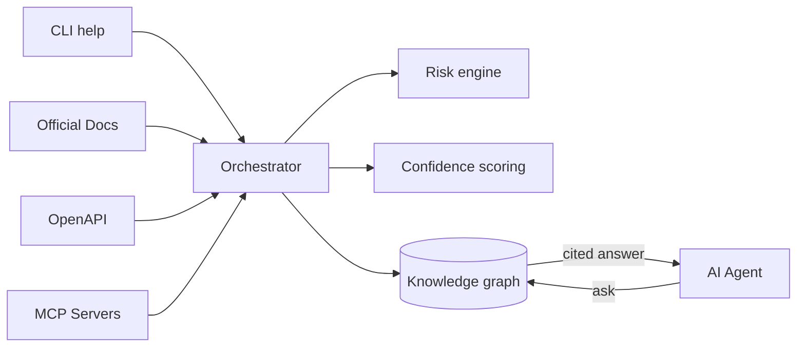

<div align="center">

```
   █████╗ ██╗   ██╗██╗██████╗ ██╗   ██╗
  ██╔══██╗╚██╗ ██╔╝██║██╔══██╗██║   ██║
  ███████║ ╚████╔╝ ██║██████╔╝██║   ██║
  ██╔══██║  ╚██╔╝  ██║██╔══██╗██║   ██║
  ██║  ██║   ██║   ██║██║  ██║╚██████╔╝
  ╚═╝  ╚═╝   ╚═╝   ╚═╝╚═╝  ╚═╝ ╚═════╝
```

### **Machine-readable external knowledge for AI agents.**

*Google is for humans. Ayiru is for agents. Your agent calls a typed API and gets back typed records — `subject_id`, `capability_type`, `argv_schema`, `flag_schema`, `effect_kind`, `verification_level` — not prose. No webpage surfing, no LLM-in-the-loop summarisation, no hallucinated flags.*

[](https://www.python.org/downloads/)
[](#-verify-it-works)
[](LICENSE)

[](#-tool-catalog)
[](#-tool-catalog)
[](#-tool-catalog)
[](#-use-it-with-claude-cursor-cline-mcp)

</div>

---

## The problem

Agents do not read web pages. They emit tokens. When an agent decides "run `gh pr create --reviewer alice`" it's pattern-matching plausible syntax from training data that's months out of date. Deprecated flags ship. Removed subcommands ship. Hallucinated arguments ship.

Vector search over docs doesn't fix this — the agent still gets back prose that it has to summarise, paraphrase, and convert into a command at decoding time. Every step is a chance to corrupt the result.

## The fix — typed records, no prose

Ayiru is a read-only **structured knowledge layer**. The agent asks for a subject's capabilities; Ayiru returns typed `Capability` records with `argv_schema`, `flag_schema`, `effect_kind` populated from actual `--help` parses. No prose statements, no summarisation, no LLM in the loop.

```python
from ayiru_client import Ayiru

with Ayiru() as a:
    caps = a.get_capabilities(subject_id="gh-pr-create",
                              capability_types=["invocation"])

top = caps.capabilities[0]
print(top.source)              # → 'structured'
print(top.verification_level)  # → 'L3_runtime_verified'
print(top.detail["command"])   # → 'gh pr create'
print(len(top.detail["flag_schema"]))   # → 22
print(top.detail["flag_schema"][0])
# → {
#     "name": "--assignee",
#     "short": "-a",
#     "value_type": "string",
#     "value_name": "login",
#     "takes_value": true,
#     "required": false,
#     "deprecated": false,
#     "description": "Assign people by their login. Use \"@me\" to self-assign."
#   }
```

`L3_runtime_verified` means Ayiru actually spawned `gh --help` and parsed it. Every flag's type, default, deprecation status, and short-form is a real field — not text the agent has to extract. The agent constructs `gh pr create --assignee @me --base main --body "..."` from typed metadata, not from a hallucinated guess.

## What's in the box

- **7 structured query tools** advertised over MCP — `resolve_subject`, `get_subject_spec`, `get_capabilities`, `get_constraints`, `get_effects`, `resolve_action`, `get_workflow_plan`. All return typed records; none return prose.
- **Structured catalog** — the current bulk DB is machine-readable only: 28 tool families, 3,237 subjects, 32,733 typed capabilities, 3,988 typed constraints, and 3,084 typed effects. The flag/argv capabilities are `L3_runtime_verified` (parsed from a real CLI/runtime surface); the effect safety classifications are `L2_source_verified` (inferred from help text, not asserted by an experiment), and every record carries its own `verification_level` so the agent can tell them apart.
- **MCP server** — drop into Claude Desktop / Cursor / Cline / Continue via stdio JSON-RPC. Zero config.
- **Python SDK** — sync + async clients for every typed surface.
- **Legacy query surfaces** (`ask`, `validate_command`, `search_tools`, `explain_risk`, `get_safe_workflow`, `get_tool_spec`) remain available but are hidden from `tools/list`. The current bulk and bundled catalogs are structured-only, so fresh agents see and consume typed records by default.

---

### Get started in 30 seconds

```bash
git clone https://github.com/ruth411/ayiru.git && cd ayiru
docker build -t ayiru . && docker run --rm -p 8000:8000 ayiru
```

Then:

```bash
curl -X POST http://localhost:8000/v1/query/capabilities \
  -H 'Content-Type: application/json' \
  -d '{"subject_id": "gh-pr-create", "capability_types": ["invocation"], "limit": 1}'
# → typed record: subject_id, capability_type=invocation,
#   detail.command="gh pr create", detail.flag_schema=[{name:"--assignee",...}, ...],
#   source="structured", verification_level="L3_runtime_verified"
```

Or open <http://localhost:8000/docs> for the interactive API.

---

## 📥 Install Ayiru

> **Pick your path.** Each one ends with a running Ayiru server on `http://localhost:8000`.

<table>
<tr>
<td width="33%" align="center">

### 🐳 Docker
**~3 minutes**<br/>
Zero Python setup<br/>
Full structured catalog (28 families, 3,237 subjects)<br/>
<br/>
[→ Jump to Docker](#-path-1-docker-easiest)

</td>
<td width="33%" align="center">

### 🐍 Python
**~5 minutes**<br/>
Hackable + local files<br/>
Best for SDK users<br/>
<br/>
[→ Jump to Python](#-path-2-python--pip-for-developers)

</td>
<td width="33%" align="center">

### 🛠 Source
**~10 minutes**<br/>
Edit + test changes<br/>
Best for contributors<br/>
<br/>
[→ Jump to source](#-path-3-from-source-for-contributors)

</td>
</tr>
</table>

---

### 🐳 Path 1: Docker (easiest)

> **Best if:** you just want to try Ayiru. No Python knowledge needed.

#### ✅ Before you start

You need [Docker Desktop](https://www.docker.com/products/docker-desktop/) (macOS / Windows) or `docker` (Linux). Verify:

```bash
docker --version
# Docker version 27.x or newer ✓
```

#### Step 1 — Clone the repo

```bash
git clone https://github.com/ruth411/ayiru.git
cd ayiru
```

#### Step 2 — Build the image

```bash
docker build -t ayiru .
```

> **What's happening?** Docker is building a self-contained image with Python, Ayiru, and the full structured catalog: 28 tool families, 3,237 subjects, 32,733 typed capabilities, 3,988 typed constraints, and 3,084 typed effects. Takes ~2 minutes the first time.

#### Step 3 — Run it

```bash
docker run --rm -p 8000:8000 ayiru
```

The Docker image defaults `AYIRU_STRICT_TOOL_LOCK=1`, so network-exposed
container deployments reject unknown `tool_id`s by default. Opt out only if
you intentionally want uncurated tool ingestion:

```bash
docker run --rm -p 8000:8000 -e AYIRU_STRICT_TOOL_LOCK=0 ayiru
```

You should see:

```
INFO:     Uvicorn running on http://0.0.0.0:8000
INFO:     Started server process [1]
INFO:     Waiting for application startup.
INFO:     Application startup complete.
```

#### Step 4 — Try your first query ✨

In a new terminal:

```bash
curl -s -X POST http://localhost:8000/v1/query/resolve-subject \
  -H 'Content-Type: application/json' \
  -d '{"subject_hint": "open a github pull request"}' | jq '.matches[0]'
# → {"subject_id":"gh-pr-create", "subject_kind":"invocation",
#    "family":"gh", "capability_count":25,
#    "verification_level":"L3_runtime_verified", ...}
```

Or open the interactive docs at **<http://localhost:8000/docs>** in your browser.

🎉 **Done.** Skip to [Your First Query](#-your-first-query) to see what Ayiru can do.

---

### 🐍 Path 2: Python + pip (for developers)

> **Best if:** you want to write Python code against Ayiru locally.

#### ✅ Before you start

You need **Python 3.12+**. Check:

```bash
python3 --version
# Python 3.12.x ✓
```

<details>
<summary><b>Don't have Python 3.12?</b> Click to install</summary>

- **macOS:** `brew install python@3.12`
- **Linux (Ubuntu):** `sudo apt install python3.12 python3.12-venv`
- **Windows:** [Download from python.org](https://www.python.org/downloads/)

</details>

#### Step 1 — Clone + enter the repo

```bash
git clone https://github.com/ruth411/ayiru.git
cd ayiru
```

#### Step 2 — Create a virtual environment

```bash
python3.12 -m venv backend/.venv
source backend/.venv/bin/activate    # macOS/Linux
# .\backend\.venv\Scripts\activate   # Windows PowerShell
```

> **What's a venv?** A folder that holds Ayiru's dependencies, so it doesn't conflict with anything else on your system.

#### Step 3 — Install Ayiru

```bash
pip install -e 'backend[dev]'
```

> **Why `-e`?** "Editable install" — changes you make to the code show up immediately.

#### Step 4 — Start the server

Two flavors depending on what you want:

```bash
# (a) Demo graph — small, offline-safe (~47 claims, 5 tools)
ayiru seed --reset
ayiru serve --reload

# (b) Full structured catalog — 28 tool families, 3,237 subjects
AYIRU_DATABASE_URL="sqlite:///$(pwd)/backend/ayiru_v0.2_bulk.db" \
    ayiru serve --reload
```

`ayiru serve` auto-applies pending Alembic migrations before boot. If migration fails, the server exits non-zero instead of starting against a stale schema. Pass `--no-migrate` only if you manage schema changes out of band.

You should see:

```
INFO:     Uvicorn running on http://127.0.0.1:8000
INFO:     Started server process
INFO:     Application startup complete.
```

#### Step 5 — Try it

Open <http://localhost:8000/docs> in your browser or run the curl command from Path 1 above.

🎉 **Done.** Skip to [Your First Query](#-your-first-query).

---

### 🛠 Path 3: From source (for contributors)

> **Best if:** you want to modify Ayiru, run tests, add tools to the catalog.

Same as Path 2, plus:

```bash
# Run the test suite (~1 minute, 888 tests)
cd backend
.venv/bin/python -m pytest -q

# Lint
.venv/bin/ruff check app tests
```

For adding a new tool to the catalog, see [Growing the Catalog](#-growing-the-catalog).

---

## ✨ Your First Query

Once Ayiru is running on `http://localhost:8000`, try the structured surface — the same one the agent calls over MCP.

### 1️⃣ Resolve a subject from a fuzzy hint

```bash
curl -s -X POST http://localhost:8000/v1/query/resolve-subject \
  -H 'Content-Type: application/json' \
  -d '{"subject_hint": "create a github pull request"}' | jq '.matches[0]'
```

**Expected response (typed `SubjectSummary`):**

```json
{
  "subject_id": "gh-pr-create",
  "subject_kind": "invocation",
  "name": "gh pr create",
  "family": "gh",
  "capability_count": 25,
  "verification_level": "L3_runtime_verified",
  "match_reason": "name match on 'pr create'"
}
```

### 2️⃣ Pull typed capabilities + effects

```bash
curl -s -X POST http://localhost:8000/v1/query/capabilities \
  -H 'Content-Type: application/json' \
  -d '{"subject_id": "gh-pr-create", "capability_types": ["invocation"], "limit": 1}' \
  | jq '.capabilities[0] | {source, capability_type, command: .detail.command, flag_count: (.detail.flag_schema | length), first_flag: .detail.flag_schema[0]}'
```

**Expected response:**

```json
{
  "source": "structured",
  "capability_type": "invocation",
  "command": "gh pr create",
  "flag_count": 22,
  "first_flag": {
    "name": "--assignee",
    "short": "-a",
    "value_type": "string",
    "value_name": "login",
    "takes_value": true,
    "required": false,
    "deprecated": false,
    "description": "Assign people by their login. Use \"@me\" to self-assign."
  }
}
```

### 3️⃣ Use the Python SDK

```python
from ayiru_client import Ayiru

with Ayiru(base_url="http://localhost:8000") as client:
    # Discovery
    subjects = client.resolve_subject(subject_hint="delete a docker container")
    top = subjects.matches[0]
    print(top.subject_id, top.verification_level)

    # Typed capabilities for that subject
    caps = client.get_capabilities(subject_id=top.subject_id,
                                   accepted_only_structured=True)
    for cap in caps.capabilities[:3]:
        print(cap.capability_type, "→", cap.title)
        # cap.detail is a dict with argv_schema, flag_schema, etc.

    # End-to-end action grounding (capability + constraints + effects in one shot)
    plan = client.resolve_action(subject_id="gh-pr-create",
                                 action_intent="open a draft PR")
    print(plan.top_capability.detail["command"])
    print(plan.requires_human_confirmation, plan.risk_level)
```

---

## 🤖 Use it with Claude, Cursor, Cline (MCP)

The recommended way to use Ayiru with a coding agent is the standalone
`ayiru-mcp` package. It ships with a pre-built structured catalog inside the
wheel — no server, no database to point at, no API key.

### Install (any MCP client)

```bash
pip install ayiru-mcp
```

That gives you the `ayiru-mcp` console script. Add it to your client's MCP config:

**Claude Desktop** — `~/Library/Application Support/Claude/claude_desktop_config.json`:

```json
{
  "mcpServers": {
    "ayiru": { "command": "ayiru-mcp" }
  }
}
```

**Cursor / Cline / Continue** — same shape; consult your client's docs for
the JSON location. The advertised tools after restart (typed I/O, no prose):

| Tool | Returns |
|---|---|
| `resolve_subject` | Typed `SubjectSummary` records from a fuzzy hint. **Call this first.** |
| `get_subject_spec` | Full `SubjectSpec` for a known `subject_id` |
| `get_capabilities` | Typed `CapabilityRecord` rows — invocations, configs, constraints, effects |
| `get_constraints` | Typed constraint records — auth scopes, env preconditions, deprecation |
| `get_effects` | Typed effect profile — destructive / mutates_remote_state / reversible booleans |
| `resolve_action` | End-to-end grounding — top capability + constraints + effects + risk verdict |
| `get_workflow_plan` | Goal-matched workflow plans, safest-first |

Ask the agent *"what flags does `gh pr create` accept?"* — it'll call
`resolve_subject` then `get_capabilities` and get back 22 typed flag
records with `value_type`, `takes_value`, `required`, `deprecated` populated.
No hallucination because no prose to misread.

The legacy prose surfaces (`ask`, `validate_command`, `search_tools`,
`explain_risk`, `get_safe_workflow`, `get_tool_spec`) remain registered for
backward compatibility but are hidden from `tools/list`. Fresh tool discovery
shows only the typed surfaces.

The bundled `ayiru-mcp` contract is documented in
[`docs/mcp_v1_contract.md`](docs/mcp_v1_contract.md). The current bundled
catalog ships no published workflow specs yet, so `get_workflow_plan` may
return zero plans.

### Semantic re-rank (optional)

```bash
pip install ayiru-mcp[semantic]
```

Pulls `fastembed` (~130 MB ONNX model on first use). Without this extra
the server runs in pure lexical mode — already useful, but query phrasings
that don't share tokens with the catalog rank worse.

### Catalog scope

The bundled wheel ships the **full structured catalog** (~49 MB SQLite):
28 tool families, 3,237 subjects, 32,733 typed capabilities, 3,988
constraints, and 3,084 effects. It is machine-readable only: no prose
claims, no evidence rows, no fallback publication tables.

<details>
<summary><b>Dev path: <code>python -m app.mcp_server</code> against the full catalog</b></summary>

Contributors and self-hosters who want the full catalog over MCP can
still register the legacy entry point:

```json
{
  "mcpServers": {
    "ayiru": {
      "command": "/absolute/path/to/.venv/bin/python",
      "args": ["-m", "app.mcp_server"],
      "env": {
        "AYIRU_DATABASE_URL": "sqlite:////absolute/path/to/backend/ayiru_v0.2_bulk.db"
      }
    }
  }
}
```

This path advertises the same 7 structured tools. Hidden legacy tools plus
`submit_claim` remain callable in the writable backend/dev path, but they are
not advertised by the published `ayiru-mcp` wheel.
</details>

---

## 📦 Tool Catalog

Ayiru's published DB is a **structured catalog**: 28 tool families, 3,237
subjects, 32,733 capabilities, 3,988 constraints, and 3,084 effects. The
older depth-pass ingestion work still matters because many families were
originally sourced through a five-surface decomposition before being compiled
into typed rows:

| Surface | What's on it |
|---|---|
| 🟦 **`{tool}-cli`** | Per-command pages from official docs (`docker run`, `git rebase`) |
| 🟪 **`{tool}-config`** | Config-file format, environment, runtime options |
| 🟩 **`{tool}-recipes`** | Real-world workflows: "trim a video", "force-push safely" |
| 🟥 **`{tool}-errors`** | Actual error messages with diagnosis + fix steps |
| 🟨 **`{tool}-{topic}`** | Tool-specific extras: `docker-build`, `git-workflows`, `kubectl-resources`, `go-stdlib`, `ansible-modules` |

### 🏆 Deep-coverage tools

⭐ = perfect probe (50/50 questions returned actionable cited answers)

<details open>
<summary><b>30+ tools with full depth-pass coverage</b></summary>

| Tool | Claims | Probe | Highlights |
|---|---:|---:|---|
| `ansible` | 634 | 25/25 ⭐ | Modules (499), playbook, vault, inventory |
| `docker` | 136 | 44/45 | CLI + Dockerfile + buildx + compose |
| `gh` (GitHub) | 129 | 49/50 | auth, pr, repo, workflows, codespaces |
| `helm` | 128 | 48/50 | Charts + template guide + OCI registry |
| `kubectl` | 127 | 50/50 ⭐ | 43 per-command + RBAC + debugging |
| `openai-api` | 125 | 50/50 ⭐ | Chat / embeddings / vision / whisper |
| `awk` | 118 | 40/40 ⭐ | Language + builtins + scripting |
| `git` | 109 | 46/50 | 31 per-command + hooks + submodules |
| `go` | 108 | 50/50 ⭐ | 30 stdlib + generics + reasoning models |
| `pip` | 105 | 49/50 | PEP 668, hash-pinning, uv migration |
| `cargo` | 105 | 40/40 ⭐ | Build profiles, workspaces, features |
| `openssl` | 100 | 50/50 ⭐ | Keys, certs, CSR, TLS debugging |
| `postgresql` | 101 | 50/50 ⭐ | 23 CLIs + WAL + replication + recovery |
| `postgresql-psql` | 91 | 50/50 ⭐ | Meta-commands + variables + scripting |
| `pnpm` | 107 | 50/50 ⭐ | Workspaces, catalogs, patch deps |
| `poetry` | 99 | 50/50 ⭐ | Groups, lockfile, deploy patterns |
| `sqlite3` | 96 | 50/50 ⭐ | SQL + WAL + JSON1 + FTS5 + pgvector |
| `sed` | 84 | 50/50 ⭐ | Substitution + regex + GNU vs BSD |
| `jq` | 74 | 45/45 ⭐ | Filters + functions + real pipelines |
| `journalctl` | 75 | 44/45 | Filters, fields, persistent storage |
| `apt` | 164 | 49/49 ⭐ | CLI + sources + dpkg interop |
| `rust` | 113 | 48/50 | Lang + stdlib + cargo errors |
| `supabase` | 98 | 49/50 | CLI + migrations + RLS + edge fns |
| `ffmpeg` | 92 | 38/45 | Filters + recipes (trim, hwaccel, GIF) |
| `imagemagick` | 86 | 43/45 | Resize, watermark, PDF→PNG |
| `gpg` | 82 | 42/45 | Key gen, sign/verify, smartcard |
| `rsync` | 70 | 48/50 | Mirror, hardlinks, daemon, SSL |
| `ssh` | 66 | 45/45 ⭐ | Keys, config, tunnels, hardening |
| `curl` | 73 | 40/40 ⭐ | Protocols, auth, debugging |
| `brew` | 71 | 33/33 ⭐ | Formulae, taps, troubleshooting |
| `dnf` | 57 | 37/37 ⭐ | Repos, history, modules |

</details>

Plus thin-coverage entries carried from earlier seeding: `terraform`, `vercel`, `systemctl`, `wget`, `vim`, `tmux`, `uv`, `yarn` — next depth-pass targets.

---

## 🛠️ How It Works



Structured ingesters and curated source artifacts compile into typed
`subjects`, `capabilities`, `constraints`, and `effects` rows. Legacy
claim/evidence ingestion lanes still exist in the codebase for historical and
specialized workflows, but the current bulk and bundled catalogs that agents
query are structured-only.

---

## 🎯 Core Principles

| Principle | What it means |
|---|---|
| 📎 **Evidence before publication** | No claim enters the graph without cited evidence. LLM reasoning is never primary evidence. |
| 📐 **Structured over prose** | Agents submit typed `KnowledgeClaim` objects, not free-form articles. |
| ⚠️ **Safety is first-class** | Every command is classified by side effects, risk, auth, destructive potential. |
| 🎚️ **Verification levels are explicit** | Every record exposes its own level on the `L0_unverified` → `L5_human_audited` scale. Structured `gh` flag/argv data is `L3_runtime_verified` (parsed from a real `--help` run); inferred effect/constraint classifications are `L2_source_verified`, not silently promoted to L3. |
| 🔗 **Provenance is preserved** | Every canonical spec traces back to source claims and source bytes. |
| 🛡️ **Sources are data, not instructions** | Docs, CLI output, MCP metadata are scanned; their instructions are never executed. |

---

## 🚨 Troubleshooting

### "docker: command not found"
→ Install [Docker Desktop](https://www.docker.com/products/docker-desktop/). On Linux, `sudo apt install docker.io`.

### "Port 8000 is already in use"
```bash
docker run --rm -p 8080:8000 ayiru   # use port 8080 instead
```

### "Python 3.12 is too new / not available"
Install with [pyenv](https://github.com/pyenv/pyenv) or [mise](https://mise.jdx.dev/):
```bash
pyenv install 3.12 && pyenv local 3.12
```

### "Ayiru returns `fallback_recommended: true`"
That's by design — Ayiru is being honest that it doesn't have a high-confidence answer. Your agent should escalate to web search.

### "I can't find my Claude Desktop config"
- **macOS:** `~/Library/Application Support/Claude/claude_desktop_config.json`
- **Windows:** `%APPDATA%\Claude\claude_desktop_config.json`
- **Linux:** `~/.config/Claude/claude_desktop_config.json`

### Tests pass locally but Docker build fails
Clear Docker cache: `docker system prune -a` then rebuild.

---

## 🏗️ Architecture

```
ayiru/
├── backend/
│   ├── app/                # FastAPI app, MCP server, services
│   ├── alembic/            # Migrations
│   ├── ayiru_v0.2_bulk.db  # 🌟 Full structured catalog (28 families, 3,237 subjects)
│   └── tests/              # 888 hermetic tests
├── clients/python/         # ayiru-client SDK + LangChain adapter
├── tools/                  # URL lists + seed scripts (per tool)
├── contracts/              # Versioned JSON trust + ingestion contracts
├── data/seed_artifacts/    # Demo seed for offline-safe install
└── Dockerfile              # Single-stage image
```

<details>
<summary><b>🔑 Key design decisions</b></summary>

- **Contracts as ground truth.** Trust allowlists, ingestion sources, risk taxonomies are versioned JSON files in `contracts/`. They can't drift from code without a test failing.
- **Five-surface tool decomposition.** Each major tool splits into `-cli`, `-config`, `-recipes`, `-errors`, and one topic-specific surface. Lets agents direct queries and lets the matcher rank within the right neighborhood.
- **Protocol-based dependency injection.** Every external dep (HTTP client, MCP runner, sandbox) is a `typing.Protocol`. Tests inject fakes; production injects real things. Hermetic test suite.
- **Adversarial tests, not happy-path tests.** Every ingestion lane has tests for SSRF, redirect attacks, oversized responses, malformed inputs, structured 422s.
- **Structured-first retrieval.** Agents hit typed subject/capability/constraint/effect rows first. Legacy claim-search and embedding paths remain in code, but the shipped catalogs do not depend on prose rows.

</details>

---

## 🌐 API Reference

Live interactive docs at **<http://localhost:8000/docs>** when the server is running.

### Structured query API (under `/v1/query/`)

| Endpoint | Purpose |
|---|---|
| `POST /v1/query/resolve-subject` | Resolve a fuzzy hint into typed subjects |
| `GET /v1/query/subjects/{subject_id}` | Canonical `SubjectSpec` |
| `POST /v1/query/capabilities` | Typed capability records |
| `POST /v1/query/constraints` | Typed constraints and prerequisites |
| `POST /v1/query/effects` | Typed effects and aggregate risk signals |
| `POST /v1/query/resolve-action` | One-shot action grounding |
| `POST /v1/query/workflow-plan` | Published workflow plans |

### Compatibility query API

| Endpoint | Purpose |
|---|---|
| `POST /v1/query/ask` | Natural-language question → ranked, cited answers |
| `POST /v1/query/validate-command` | Safety verdict for a command |
| `GET /v1/query/tools/{tool_id}` | Canonical `ToolSpec` |
| `GET /v1/query/search-tools?q=` | Search published tools |
| `POST /v1/query/explain-risk` | Risk classification with reasons |
| `POST /v1/query/safe-workflow` | Legacy workflow lookup |

<details>
<summary><b>📥 Operator + pipeline endpoints</b></summary>

**Claims** — `POST/GET /claims` · `POST /claims/{id}/verify`
**Ingestion** — `POST /ingestion/{cli,docs,openapi,json_schema,graphql,mcp}`
**Canonical** — `POST/GET /canonical/tools/{id}` · `/canonical/workflows/{id}`
**Verification** — `POST /verification/runtime` · `POST /verification/human-review`
**Audit** — `GET /audit/events` · `GET /audit/claims/{id}`

</details>

---

## 🐍 Python SDK

```python
from ayiru_client import Ayiru, AsyncAyiru

# Sync
with Ayiru(base_url="http://localhost:8000") as c:
    a = c.ask("how do I remove a docker volume")
    if a.is_useful:
        print(a.top.statement)

# Async
async with AsyncAyiru(base_url="http://localhost:8000") as c:
    a = await c.ask("...")
```

**LangChain adapter** — drop-in `BaseTool`:

```bash
pip install -e 'clients/python[langchain]'
```

See [clients/python/README.md](clients/python/README.md) for the full reference.

---

## 🧪 Catalog Maintenance

For the current structured-only product, the operator workflow is:

```bash
# Rebuild the bundled MCP catalog from the current bulk DB, run smoke,
# and print coverage + freshness summaries.
backend/.venv/bin/python tools/scripts/rebuild_structured_product.py

# If you've edited tools/tool_sources/*.v1.json, upsert those curated
# source artifacts into the bulk DB first.
backend/.venv/bin/python tools/scripts/rebuild_structured_product.py --refresh-curated

# Per-family audits
backend/.venv/bin/python tools/scripts/report_tool_coverage.py --database backend/ayiru_v0.2_bulk.db --top 10
backend/.venv/bin/python tools/scripts/report_catalog_freshness.py --database backend/ayiru_v0.2_bulk.db --top 10
```

`tools/tool_sources/*.v1.json` is the checked-in machine-readable source layer
for the current curated families. `tools/scripts/compile_curated_sources.py`
validates and ingests those artifacts directly; `smoke_product.py` verifies
that `resolve_subject()`, `get_capabilities()`, `get_effects()`, and
`resolve_action()` still work against both the bulk DB and the bundled MCP
catalog.

---

## 📈 Growing the Catalog

Adding a new tool takes ~30 minutes:

1. 📜 Add to `contracts/tool_trust_sources.v1.json` — declare official hosts
2. 🔗 Build URL list in `tools/v0.2_seed_<tool>.json`
3. 🛂 Patch `contracts/docs_ingestion_sources.v1.json` with URLs + subjects
4. 🕷️ Crawl: `ayiru ingest --tool-list tools/v0.2_seed_<tool>.json --source docs --resume`
5. ✍️ Synthesize errors + recipes in `tools/scripts/seed_<tool>_errors_recipes.py` (~30 errors + 35 recipes)

Probe with ~45 questions, check tests + ruff, commit. See `tools/scripts/seed_*_errors_recipes.py` for the pattern across 30+ tools.

---

## ✅ Verify it works

```bash
cd backend

# Run all 888 tests (~1 minute)
.venv/bin/python -m pytest -q

# Lint
.venv/bin/ruff check app tests
```

---

## 🔐 Security

<table>
<tr>
<td width="50%">

#### 🌐 HTTP API

Set `AYIRU_API_KEY` env var to require `Authorization: Bearer <key>` on all write endpoints plus the sensitive read surfaces: audit history (`/audit/*`), ingestion artifacts (`/ingestion/*`), and verification-result listings (`/verification-results*`). Query / lookup reads stay public so agents can ask without coordinating creds. Timing-safe comparison.

</td>
<td width="50%">

#### 🔌 MCP stdio

The MCP server is local-first. By default it assumes the caller is a trusted local process (Claude Desktop, Cursor), but you can require `initialize.params.ayiru_shared_secret` by setting `AYIRU_MCP_SHARED_SECRET`. Don't pipe `ayiru mcp` over SSH or expose it to untrusted callers without that secret.

</td>
</tr>
</table>

> ⚠️ For any network-exposed deployment, set `AYIRU_API_KEY`, put it behind a reverse proxy with rate limiting, and only enable forwarded-client rate-limit keying when that proxy is trusted. See [SECURITY.md](SECURITY.md).

---

<details>
<summary><b>⚙️ Configuration (env vars)</b></summary>

| Variable | Default | Purpose |
|---|---|---|
| `AYIRU_DATABASE_URL` | `sqlite:///./ayiru.db` | SQLAlchemy URL. Point at `backend/ayiru_v0.2_bulk.db` for the full structured catalog. |
| `AYIRU_API_KEY` | unset | Required Bearer token for write endpoints plus `/audit/*`, `/ingestion/*`, and `/verification-results*` reads. |
| `AYIRU_TRUSTED_HOSTS` | unset | Optional comma-separated host allowlist for inbound HTTP `Host` headers. Supports exact hosts and `*.example.com` wildcard entries. |
| `AYIRU_MCP_SHARED_SECRET` | unset | When set, requires MCP clients to send `params.ayiru_shared_secret` in the `initialize` request before any other MCP method is allowed. |
| `AYIRU_ASK_RATE_LIMIT_REQUESTS` | unset | When set to a positive integer, rate-limits `POST /query/ask` and `POST /v1/query/ask` per client key. By default this is the socket peer address. |
| `AYIRU_ASK_RATE_LIMIT_WINDOW_SECONDS` | `60` | Window size for `AYIRU_ASK_RATE_LIMIT_REQUESTS`. Ignored unless the ask limiter is enabled. |
| `AYIRU_RATE_LIMIT_TRUST_FORWARDED_FOR` | unset | When set to `1` / `true`, trust the first `X-Forwarded-For` hop for ask() rate-limit keying. Only enable behind a trusted reverse proxy. |
| `AYIRU_REVIEWER_REGISTRY` | unset | Comma-separated allowlist of reviewer IDs. |
| `AYIRU_STRICT_TOOL_LOCK` | unset in source installs; `1` in Docker image | Refuses unknown `tool_id`s at `POST /claims`. Recommended for network-exposed deployments. |
| `AYIRU_ALEMBIC_INI` | autodetect | Override path to `alembic.ini`. |
| `AYIRU_SEED_SCRIPT` | autodetect | Override path to `seed_examples.py`. |

</details>

<details>
<summary><b>🚧 What's not done yet</b></summary>

- **PyPI publication.** `pip install ayiru` doesn't work yet. Install from source for now.
- **Hosted version.** No SaaS. Run it yourself.
- **~15 tools have only thin coverage** — `terraform`, `vercel`, `wget`, `vim`, etc. Next on the depth-pass queue.
- **Freshness refresh is still manual.** `report_catalog_freshness.py` shows staleness; re-ingesting upstream sources is still an operator step.
- **SQLite only in CI.** Schema is Postgres-portable but no live Postgres tests in CI.
- **No external auth provider.** Bearer-token only for now.

</details>

---

## 📚 More

- 🤝 [Contributing](CONTRIBUTING.md)
- 🛡️ [Security policy](SECURITY.md)
- 📖 [Stage report](docs/stage_report.md) (historical per-stage audit)
- 🔒 [Trust contract](docs/trust_contract.md)
- 🐍 [SDK README](clients/python/README.md)

---

## 📜 License

**MIT** — see [LICENSE](LICENSE).

## 🙏 Built with

[FastAPI](https://fastapi.tiangolo.com/) · [Pydantic v2](https://docs.pydantic.dev/) · [SQLAlchemy 2](https://www.sqlalchemy.org/) · [Alembic](https://alembic.sqlalchemy.org/) · [httpx](https://www.python-httpx.org/) · [fastembed](https://github.com/qdrant/fastembed) · the [Model Context Protocol](https://modelcontextprotocol.io/)

<div align="center">

<br/>

**[⬆ back to top](#)**

<br/>

*Built because AI agents shouldn't have to guess.*

</div>
